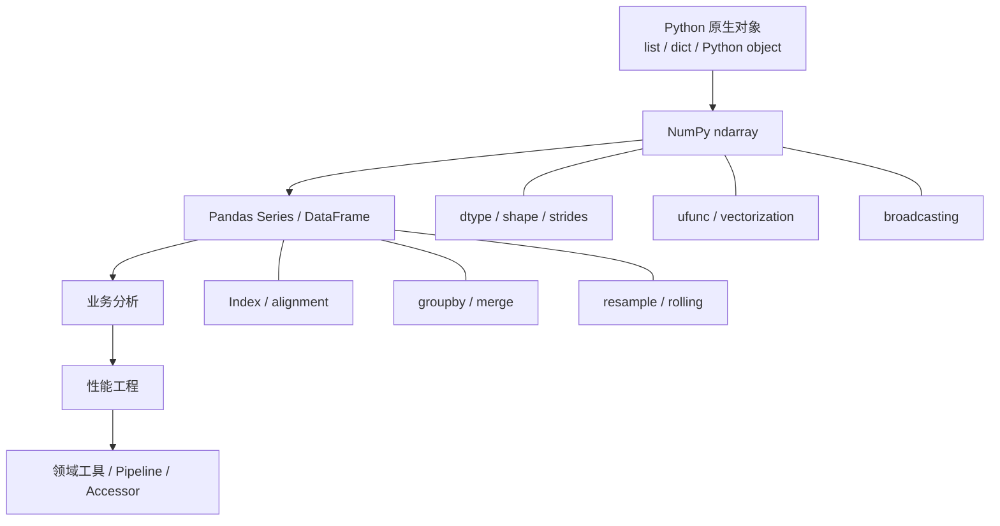
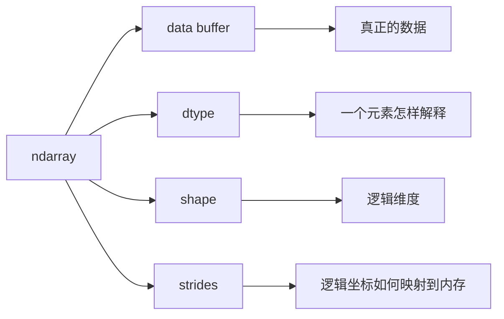

# Python 数据数学分析核心课件

## 目录

## 1. 引言:从工程代码回归数据本质

### 1.1 为什么是 Python？

在传统的软件后端开发中, 关注点通常是 **状态管理、网络 I/O、并发安全与面向对象的解耦抽象**. 然而, 当进入数据分析与科学计算领域时, 思维模型需要发生根本性转变:

```
[传统后端工程思维]                     [现代数据分析/矩阵思维]
对象封装(OOP)                   ->   数据与操作分离(Data-Oriented Design)
逐个遍历(for item in list)       ->   批量向量化计算(SIMD / Tensor Processing)
复杂控制流(if-else / 状态机)      ->   布尔掩码与索引选择(Mask & Fancy Indexing)
显式多线程/锁竞争                 ->   底层 C/Fortran/BLAS 内存连续并行计算
```

Python 之所以能够统治现代数据科学与 AI 领域, 并非因为其解释器运行效率高(相反, CPython 的解释器开销与 GIL 限制众所周知), 而是因为它的 **"胶水特性" 与 C-API 扩展能力**:

1. 上层提供极具表现力的动态语法和交互式 REPL 环境;
2. 下层无缝对接 OpenBLAS、MKL、CUDA 等底层硬件加速库;
3. 形成了从数据摄取(Pandas/Arrow)、处理(NumPy/SciPy)、可视化(Matplotlib/Seaborn)到模型训练(PyTorch/Scikit-learn)的完整闭环. 

> 为什么 Python 明明什么都能算, 我们还需要 NumPy 和 Pandas？

> NumPy 和 Pandas 真正带来的价值, 是“多了一堆 API”, 还是“改变了数据和计算的抽象方式”？

### 我们真正要学的不是 API

假设现在拿到 200 万条出租车订单. 

我们需要分析:

```text
哪些订单不可信？

什么时候最忙？

什么时候流水最高？

哪些区域最热门？

哪些订单看起来异常？

为什么同一个计算, 有人的代码跑几十秒, 有人的代码只跑几秒？

怎么把这些分析变成公司里以后还能复用的工具？
```

当然, 可以全部使用 Python:

```python
for row in rows:
    ...
```

但问题并不在于 Python **能不能做**. 

真正的问题是:

> **Python 原生的数据结构和逐对象执行模型, 并不是专门针对百万级同构数值计算和二维表格分析设计的. **

但是 Numpy 和 Pandas 是 Python 中专门为数据分析设计的

1. NumPy 的核心是同构 $N$ 维数组 `ndarray`；官方文档将其定义为 NumPy 的核心多维数组结构, 并围绕数组提供高效的数学、逻辑、选择、排序、线性代数等运算. 
2. Pandas 则在数组之上增加了 **标签、索引、缺失值、异构列、自动对齐、分组、连接和时间序列** 等更贴近表格数据分析的抽象；`Index` 本身就是 Pandas 用于索引和对齐的轴标签对象. 



一句话概括:
> **NumPy 解决“如何高效计算数组”；Pandas 解决“如何带着业务语义高效组织、查询、组合和分析表格数据”. **

### 出租车数据集简介

NYC TLC Yellow Taxi Trip Records 是纽约市出租车与豪华轿车委员会(NYC Taxi & Limousine Commission, TLC)公开发布的纽约市黄色出租车行程记录数据.

### 贯穿本节的七个问题

| 问题 | 业务问题 | 逐步引出的技术 |
|---|---|---|
| **Q1** | 这 200 万条数据可靠吗？ | `dtype`、缺失值、mask、`loc`、`query` |
| **Q2** | 一天中什么时候最忙？ | `datetime`、`groupby`、`agg` |
| **Q3** | 什么时间段的流水和单位运营时间收入最高？ | 向量化、`assign`、`groupby`、派生指标 |
| **Q4** | 哪些上下车区域最热门？ | `value_counts`、`merge`、连接校验 |
| **Q5** | 哪些订单和时间窗口可能异常？ | `where`、`select`、`quantile`、`transform`、`resample`、`rolling` |
| **Q6** | 为什么同一个分析可以相差一个数量级甚至更多？ | `Python loop`、`apply`、`NumPy`、`Numba`、`eval/query`、内存优化 |
| **Q7** | 如何把分析脚本变成公司可以重复使用的工具？ | `pipe`、纯函数、`Accessor`、领域 API |

### NumPy / Pandas 为什么存在

#### 问题

假设我们有 200 万个金额:

```python
prices = [...]
```

需要:

```text
全部上涨 5%
再增加 3 元服务费
过滤异常价格
求平均值
```

#### 直接使用 Python List 实现

```python
# 直接使用 List 存储与计算
result = []

for price in prices:
    result.append(price * 1.05 + 3)
```

问题是我们把 **200 万次循环控制** 交给了 Python 层. 具体来说, Python 原生 `List` 在这种大批量数值计算场景下存在两大明显短板:

**1. 存储方面**

Python `List` 并不是一块连续的数值缓冲区, 而是一个 **对象引用数组**. 它存储的每一个元素都是一个独立的 Python 对象(这里是 `float`), 每个对象都带有引用计数、类型指针等元信息. 以 200 万个金额为例:

```python
prices = [42.5, 17.3, 58.9, ...]   # 200 万个 float 对象
```

- `List` 本身只存 200 万个**指针**, 每个指针 8 字节(64 位系统)；
- 每一个 `float` 对象本身还要额外占用约 24 字节(CPython 对象头)；
- 于是 `List` 存储 200 万个浮点数的实际内存, 大约是相同规模 `ndarray` 的 **3~5 倍**.

```text
List:
  指针数组(8B × 200万) + 每个 float 对象(24B × 200万)
  ≈ 16 MB + 48 MB = 64 MB 左右

ndarray(float64):
  连续缓冲区(8B × 200万)
  ≈ 16 MB
```

内存翻倍, 还意味着缓存命中率更低、CPU 需要跨越更多随机内存地址.

**2. 计算方面**

```python
result = []
for price in prices:
    result.append(price * 1.05 + 3)
```

这段循环的执行, 每一步都发生在 **Python 解释器层**, 而不是底层机器码层:

- 每次 `for` 迭代都要经历字节码分发(bytecode dispatch)；
- 每次读取 `price` 都要做一次 **拆箱**(unboxing, 从 Python 对象还原成 C double)；
- 每次 `price * 1.05 + 3` 结果要重新 **装箱**(boxing)成新的 `float` 对象；
- 每次 `append` 还要调用方法、检查容量、可能触发列表扩容与内存重分配.

当循环次数上升到 200 万, 这些**解释器级开销被放大 200 万倍**, 成为无可忽视的性能瓶颈. 这也是为什么同样的计算, 纯 Python 循环往往比 NumPy 向量化写法慢一到两个数量级——**真正慢的不是"算", 而是"每次都要让解释器来驱动"**.

#### 使用 Numpy 和 Pandas 实现

NumPy:
```python
result = prices * 1.05 + 3
```

Pandas:

```python
result = (
    df
    .query("fare_amount > 0")
    .groupby("pickup_hour")
    .agg(avg_fare=("fare_amount", "mean"))
)
```

### Numpy 和 Pandas 的特点

**NumPy 解决的痛点(纯数值与张量计算):**
在科学计算场景下, 原生 Python 的 `list` 存储机制会导致严重的内存碎片化(频繁指针解引用)和缓存未命中(Cache Miss), 同时动态类型解释器导致循环极慢.NumPy 的诞生终结了这五大痛点:解决内存空间碎片化、消除解释器动态类型开销、填补多维张量代数的空白、终结切片的高昂拷贝代价, 并打通底层 C/BLAS 和 SIMD 硬件加速生态.

**Pandas 解决的痛点(异构业务数据与关系代数):**
真实世界的业务数据不是纯数学矩阵, 而是包含字符串、时间戳、布尔值的异构表格, 常存在缺失值和错位情况.Pandas 解决了:
1. 如何容纳异构数据类型(字符串、数值混合).
2. 在连接表或对齐时如何依据业务“键(Label)”而非纯“位置(Index)”进行运算.
3. 如何像 SQL 一样使用 GroupBy、Join 等关系代数算子.
4. 如何优雅且不中断程序地处理 NaN 缺失数据.

#### 核心设计哲学

##### NumPy 的灵魂核心:`ndarray`(N-dimensional array)
`ndarray`(N-Dimensional Array) 的本质是“同构多维连续内存缓冲区的视图抽象(N-dimensional Array / Tensor)”, 矩阵(Matrix)是它在 2 维空间下的一个特例.它的设计哲学是:**在动态语言中实现静态语言级别的内存布局.**

* **元数据解耦与视图(View):** `ndarray` 将数据的 `Header`(包含 shape、dtype、strides)与底层的 `Data Buffer`(连续物理内存)彻底分离.这使得切片、转置、Reshape 都只需要极小开销修改 Header 且不需要复制物理内存.
* **齐次强类型与 SIMD:** 数据块内类型必须一致, 使得 CPU 能够跨步寻址(索引 × 大小), 并直接投喂给硬件向量化指令.
* **面向数组编程:** 把底层长循环隐式推给 C 语言层面, 上层仅做“张量形态”的声明式表达.

##### Pandas 的根本基石:`Series` 和 `DataFrame`
如果 NumPy 是“同质数学张量”, Pandas 则是“带标签的异构列式数据框”.
* **列式存储架构:** DataFrame 本质是多个一维 `Series` 的字典集合.在底层, 同类型的列会被组织为内存连续的块.列式存储使得“求整列均值”等分析操作在物理上读取连续内存, 极其高效.
* **标签驱动(Label-Based Alignment):** 与 NumPy 严格的矩阵位置形状对齐不同, Series 和 DataFrame 的核心哲学在于“业务主键(Index)绑定”.两张表相加时, Pandas 会自动依据相同的 Index 标签进行匹配(如果没有则视为 NaN), 哪怕它们数据行数或顺序完全不同.这规避了业务分析中最致命的错位问题.

## 4. 课程环境与初始化

### Numpy 与 Pandas 的版本

本课程 Numpy 与 Pandas 需要安装与配套的版本如下:

Package         Version
------------------------------
matplotlib      3.9.4
numba           0.60.0
numpy           2.0.2
pandas          2.3.3
pyarrow         21.0.0
jupyterlab      4.5.10

### Jupyter Notebook 初始化

```python
from __future__ import annotations

import gc
import math
import os
import platform
import sys
import time
import timeit
from pathlib import Path    
from urllib.request import urlretrieve

import matplotlib.pyplot as plt
import numba
import numpy as np
import pandas as pd
import pyarrow as pa
import pyarrow.parquet as pq
from numba import njit

print("Python :", sys.version.split()[0])
print("NumPy  :", np.__version__)
print("Pandas :", pd.__version__)
print("PyArrow:", pa.__version__)
print("Numba  :", numba.__version__)
print("OS     :", platform.platform())

pd.set_option("display.max_columns", 100)
pd.set_option("display.float_format", lambda x: f"{x:,.3f}")

DATA_DIR = Path("data")
ARTIFACT_DIR = Path("artifacts")

DATA_DIR.mkdir(exist_ok=True)
ARTIFACT_DIR.mkdir(exist_ok=True)

TAXI_PARQUET_PATH = DATA_DIR / "yellow_tripdata_2025-12.parquet"

TARGET_ROWS = int(os.getenv("TAXI_ROWS", "2000000"))
BENCH_ROWS = int(os.getenv("TAXI_BENCH_ROWS", "100000"))
IO_ROWS = int(os.getenv("TAXI_IO_ROWS", str(TARGET_ROWS)))

RANDOM_SEED = 42

print(f"{TARGET_ROWS=:,}")
print(f"{BENCH_ROWS=:,}")
print(f"{IO_ROWS=:,}")
```

### 本课程统一 Benchmark 工具

```python
def benchmark(
    cases: dict[str, callable],
    *,
    repeat: int = 5,
    number: int = 1,
    warmup: int = 1,
) -> pd.DataFrame:
    """
    对多个无参 callable 做简单 benchmark. 

    注意:
    - 这不是严格的微架构性能实验工具；
    - 用于课堂比较“数量级”和相对趋势；
    - 正式性能报告应该固定 CPU、电源策略、数据、线程数和环境. 
    """
    records = []

    for name, func in cases.items():
        for _ in range(warmup):
            func()

        gc.collect()

        times = np.asarray(
            timeit.repeat(
                stmt=func,
                repeat=repeat,
                number=number,
            ),
            dtype=np.float64,
        ) / number

        records.append(
            {
                "name": name,
                "median_ms": np.median(times) * 1000,
                "min_ms": times.min() * 1000,
                "max_ms": times.max() * 1000,
            }
        )

    return (
        pd.DataFrame(records)
        .sort_values("median_ms")
        .reset_index(drop=True)
    )


def plot_benchmark(result: pd.DataFrame, title: str) -> None:
    ordered = result.sort_values("median_ms", ascending=True)

    plt.figure(figsize=(9, 4.5))
    plt.barh(ordered["name"], ordered["median_ms"])
    plt.xlabel("Median time (ms)")
    plt.ylabel("")
    plt.title(title)
    plt.tight_layout()
    plt.show()


def dataframe_memory_mb(df: pd.DataFrame) -> float:
    return df.memory_usage(index=True, deep=True).sum() / 1024**2


def file_size_mb(path: Path) -> float:
    return path.stat().st_size / 1024**2
```

> 所有性能结果都应该现场运行, 而不是在 PPT 中写死“快 10 倍”“快 100 倍”. 硬件、NumPy/Pandas/Numba 版本、数据分布、CPU 缓存和线程配置都会影响结果. Pandas 官方性能指南同样建议先实际测量, 然后再决定是否进入 Cython / Numba 等优化路径. 

## 5. NumPy:真正理解 ndarray

通过这部分希望大家可以理解下面的问题:

```text
ndarray ≠ 更快的 list

ndarray =
    data buffer
    + dtype
    + shape
    + strides
```
能够解释:
                               
- `dtype`
- `shape`
- `ndim`
- `size`
- `itemsize`
- `nbytes`
- `strides`
- `flags`
- `view`
- `copy`
- `reshape`
- `transpose`
- `axis`

### ndarray 是什么

ndarray 是 Numpy 中的一个基础类型, 它底层的简化定义如下:

```C
typedef struct {
    PyObject_HEAD

    /* Number of dimensions */
    int nd;
    /* Shape of the array */
    npy_intp *dimensions;
    /* Strides of the array */
    npy_intp *strides;
    /* Pointer to the actual data */
    void *data;
    /* Data type descriptor */
    PyArray_Descr *descr;
    /* Base object, used for views */
    PyObject *base;
    /* Flags */
    int flags;
    /* Weak references */
    PyObject *weakreflist;
    /* ... other internal fields ... */

} PyArrayObject;
```

NumPy 官方 `ndarray` 文档把 `shape`、`strides`、`ndim`、`data`、`itemsize`、`nbytes`、`base`、`dtype` 等直接列为数组(ndarray)的核心属性；`strides` 表示沿每个维度前进一步需要跨过的字节数. 



所以 `ndarray` 本质上可以理解为:

```text
Python list

┌─────┐
│ ptr │──→ Python object
├─────┤
│ ptr │──→ Python object
├─────┤
│ ptr │──→ Python object
└─────┘

NumPy ndarray

metadata:
shape   = (4,)
dtype   = float64
strides = (8,)

data buffer:
┌────────┬────────┬────────┬────────┐
│ 1.2    │ 3.4    │ 5.6    │ 7.8    │
└────────┴────────┴────────┴────────┘
```

#### 新建一个 ndarray

我们创建一个最基本的 ndarray 如下: 

```python
a = np.array([1, 2, 3, 4], dtype=np.int32)

print("array   :", a)
print("dtype   :", a.dtype)
print("shape   :", a.shape)
print("ndim    :", a.ndim)
print("size    :", a.size)
print("itemsize:", a.itemsize)
print("nbytes  :", a.nbytes)
print("strides :", a.strides)
```

Numpy 内置了很多初始化函数: 

```python
m = np.arange(12, dtype=np.int32).reshape(3, 4)

print("shape   :", m.shape)
print("dtype   :", m.dtype)
print("strides :", m.strides)
print("flags:")
print(m.flags)
```

对于上面的 C-order `int32` 数组, 一个元素 4 bytes:

```text
shape = (3, 4)

内存:

0 1 2 3 | 4 5 6 7 | 8 9 10 11

列方向移动一步:4 bytes
行方向移动一步:4 × 4 = 16 bytes

strides = (16, 4)
```

常见创建函数:

```python
examples = {
    "array": np.array([1, 2, 3]),
    "arange": np.arange(0, 10, 2),
    "linspace": np.linspace(0, 1, 5),
    "zeros": np.zeros((2, 3)),
    "ones": np.ones((2, 3)),
    "empty": np.empty((2, 3)),
}

examples
```

#### ndarray 的内存占用

我们用一个简单的例子介绍 ndarray 在存储数值上对比 `List` 的优势, 假设我们比较一百万个整数:

```python
python_list = list(range(1_000_000))
numpy_array = np.arange(1_000_000, dtype=np.int64)

python_approx_bytes = (
    sys.getsizeof(python_list)
    + sum(sys.getsizeof(x) for x in python_list)
)

print(
    "Python list 近似占用:",
    f"{python_approx_bytes / 1024**2:,.2f} MB"
)

print(
    "NumPy 元素缓冲区:",
    f"{numpy_array.nbytes / 1024**2:,.2f} MB"
)
```

这里 Python 的统计是 CPython 对象大小近似, 而 `ndarray.nbytes` 统计的是元素缓冲区本身, 两者并不是完全相同口径；这个实验的重点是理解:

> **Python list 存的是一组 Python 对象引用, 而 NumPy 可以把同类型数值紧密存储. **

但是不要为了“NumPy 看起来高级”把所有东西都放进 NumPy. 

例如:

```python
np.array(
    [
        {"name": "Alice"},
        {"name": "Bob"},
    ],
    dtype=object,
)
```

此时底层仍然绕不开 Python object, 大量 NumPy 数值计算优势会消失. 

#### ndarray 的维度 Axis 

在 ndarray 中, **`axis`(轴)的本质是多维数组维度的“索引编号”与“遍历方向”**.它定义了多维数据在逻辑结构中的组织层级, 以及算子在内存中沿哪个方向进行遍历或折叠.

**1. `axis` 的本质**

- **维度的编号:** 一个 $N$ 维数组拥有从 `0` 到 $N-1$ 的轴(支持负数索引, `-1` 代表最后一维).
- **与 `shape` 的直接映射:** `ndarray.shape` 为一个元组 $(d_0, d_1, \dots, d_{N-1})$, 其中 `axis=i` 对应的就是维度大小 $d_i$.
- **与嵌套列表层级的映射:** 最外层的中括号对应 `axis=0`, 每往里深入一层括号, `axis` 编号加 1.
- **底层内存步长(Strides)的具象化:** 在默认的 C-order 连续内存中, `axis=0` 跨度最大(跳过一整个切片/行), `axis=-1` 跨度最小(内存地址连续相邻).

**2. 指定 `axis` 到底意味着什么？**

理解 `axis` 计算最关键的一句话:**“沿着指定的 `axis` 方向移动并折叠, 消除该维度”**.

**3. `axis` 的核心作用**

- **统计与聚合(Reduction):** 控制 `sum`、`mean`、`max`、`std` 等函数的计算方向, 决定保留哪些维度、压缩哪些维度.
- **拼接与扩展(Concatenation & Stacking):**
  - `np.concatenate([a, b], axis=0)`:沿垂直方向拼接(增加行数).
  - `np.concatenate([a, b], axis=1)`:沿水平方向拼接(增加列数).
- **排序与累加(Sorting & Scanning):** 如 `np.sort(arr, axis=1)` 仅对每一行内部的元素排序, 行与行之间互不干扰.
- **维度转换与重排(Transposition):** 在图像处理(如深度学习中 `(H, W, C)` 转 `(C, H, W)`)中, 通过 `np.transpose(arr, axes=(2, 0, 1))` 重新排列各轴顺序.

```python
import numpy as np

# ==========================================
# 1. 2D 数组基础聚合(求和、均值、最值)
# ==========================================
# 创建一个 3行4列 的二维矩阵
# shape: (3, 4) -> axis 0 长度为 3, axis 1 长度为 4
data_2d = np.array([[1, 2, 3, 4], [5, 6, 7, 8], [9, 10, 11, 12]])

# 【axis=None】:不指定轴, 对所有元素进行全局计算, 结果压缩为标量
total_sum = np.sum(data_2d)  # 结果: 78, shape: ()

# 【axis=0】:沿着行索引变化的方向(纵向/跨行)向下压缩, 消除第 0 维
# 运算过程: [1+5+9, 2+6+10, 3+7+11, 4+8+12]
col_sum = np.sum(data_2d, axis=0)  # 结果: [15, 18, 21, 24], shape: (4,)

# 【axis=1】:沿着列索引变化的方向(横向/跨列)向右压缩, 消除第 1 维
# 运算过程: [1+2+3+4, 5+6+7+8, 9+10+11+12]
row_sum = np.sum(data_2d, axis=1)  # 结果: [10, 26, 42], shape: (3,)

# 【最值与索引】:找到每一行的最大值所在列索引
row_max_idx = np.argmax(data_2d, axis=1)  # 结果: [3, 3, 3], shape: (3,)


# ==========================================
# 2. 2D 数组拼接(Concatenation)
# ==========================================
a = np.array([[1, 2], [3, 4]])  # shape: (2, 2)
b = np.array([[5, 6], [7, 8]])  # shape: (2, 2)

# 【axis=0 拼接】:沿着行方向延伸(垂直向下追加新行), 列数必须相同
concat_axis0 = np.concatenate([a, b], axis=0)
# 结果: [[1, 2], [3, 4], [5, 6], [7, 8]], shape: (4, 2)

# 【axis=1 拼接】:沿着列方向延伸(水平向右追加新列), 行数必须相同
concat_axis1 = np.concatenate([a, b], axis=1)
# 结果: [[1, 2, 5, 6], [3, 4, 7, 8]], shape: (2, 4)


# ==========================================
# 3. 3D 数组的多轴聚合
# ==========================================
# 创建三维数组:2个切片(深度), 每个切片3行4列
# shape: (2, 3, 4) -> axis 0=深度(切片), axis 1=行, axis 2=列
data_3d = np.arange(24).reshape((2, 3, 4))

# 【axis=0】:跨切片压缩(把第0个切片与第1个切片对应位置相加), 消除深度维
sum_ax0 = data_3d.sum(axis=0)  # shape: (3, 4)

# 【axis=1】:切片内部跨行压缩(每个切片内各列求和), 消除行维
sum_ax1 = data_3d.sum(axis=1)  # shape: (2, 4)

# 【axis=2 / axis=-1】:切片内部跨列压缩(每个切片内各行求和), 消除列维
sum_ax2 = data_3d.sum(axis=2)  # shape: (2, 3)

# 【元组多轴压缩】:同时消除 axis 1 和 axis 2, 仅保留切片维度
sum_ax12 = data_3d.sum(axis=(1, 2))  # shape: (2,)

# ==========================================
# 4. 轴变换与重排(Transpose)
# ==========================================
# 图像常见格式转换:从 (高度, 宽度, 通道) 转为 (通道, 高度, 宽度)
# 原始维度: axis 0=H(100), axis 1=W(200), axis 2=C(3)
image_hwc = np.zeros((100, 200, 3))

# 【np.transpose】:显式重排轴的索引顺序 (2, 0, 1) 代表将旧的 axis 2 移到最前
image_chw = np.transpose(image_hwc, (2, 0, 1))  # shape: (3, 100, 200)

# 【np.swapaxes】:仅交换任意两个指定的轴(例如交换行和列)
swapped = np.swapaxes(data_2d, 0, 1)  # (3, 4) -> (4, 3), 等价于二维转置
```

#### View、Copy 与 Strides

在 ndarray 中, **`Strides`(步长)是连接高维逻辑坐标与底层一维内存的“寻址导航器”, 而 `View`(视图)与 `Copy`(副本)是由此衍生的两种内存管理策略**.NumPy 之所以能在处理海量数据时保持极高的计算性能, 本质就在于将“数据实体”与“元数据(Metadata)”彻底解耦.

**为什么必须放在一起讲？**

`View` 的物理实现完全依赖于 `Strides` 的重新映射；掌握了 `Strides` 的线性寻址逻辑, 就能一眼看穿为什么基础切片可以实现零拷贝($O(1)$ 复杂度), 而花式索引却必须退化为内存深拷贝($O(N)$ 复杂度).

**1. 本质**

- **双层架构解耦:** `ndarray` 由两部分构成:保存纯字节流的**连续数据缓冲区(Data Buffer)\**与保存描述信息的\**元数据头(Metadata Header)**(包含 `shape`、`dtype`、`strides`、`data pointer`、`base` 等).
- **`Strides`(步长)的本质:** 一个元组 $(s_0, s_1, \dots, s_{N-1})$, 表示在内存字节流中沿 `axis=i` 移动一个索引单位需要跨越的**物理字节数(Bytes)**.
- **`View`(视图)的本质:** 创建了一个全新的元数据头, 其 `data pointer` 仍指向**同一个底层内存缓冲区**.创建时间复杂度为 $O(1)$, 对视图的数据修改会直接同步到原数组(产生副作用).
- **`Copy`(副本)的本质:** 在堆内存中开辟了一块全新的独立数据缓冲区, 并将数据完整复制过去.时间复杂度为 $O(N)$, 与原数组在物理内存上完全隔离.

**2. 原理与心智模型**

- **内存线性寻址公式:** 任意多维逻辑索引 $(i_0, i_1, \dots, i_{N-1})$ 对应的底层字节偏移量为:

  $$\text{Byte Offset} = \sum_{k=0}^{N-1} (i_k \times s_k)$$

- **View vs Copy 的判定准则:**

  - **产生 View:** 只要操作后的新数据子集能够通过**单组等差步长(Strides)与基地址偏移**完全表达(如切片 `arr[::2]`、转置 `arr.T`、维度压缩 `arr.squeeze()`), NumPy 就仅修改元数据返回 View.
  - **强制 Copy:** 一旦目标元素的内存分布**无法用固定的线性步长表达**(如花式索引 `arr[[0, 2]]`、布尔掩码 `arr[arr > 5]`), 或显式调用 `.copy()`, NumPy 必须分配新内存并产生 Copy.

**3. 核心作用**

- **极速性能(Zero-Copy):** 切片、翻转、转置等操作耗时与数组大小完全无关(均在纳秒级完成), 避免大规模内存申请与数据搬运.
- **内存安全控制:** 显式调用 `.copy()` 切断与原数组的指针绑定, 防止多线程计算或数据预处理流水线中的意外内存污染.
- **内存连续性(Contiguity)管理:** ndarray 的数据是否按照 C 语言/行优先(row-major)的方式连续存储, 确保调用底层 BLAS/LAPACK 或 C/C++ 扩展时的 SIMD 向量化加速效率.
- **高级数据重组(Strided Tricks):** 通过手动操控 Strides, 无需分配额外内存即可实现图像滑动窗口(Sliding Window)、重叠切片或卷积核展开.

**4. 完整教学代码与注释**

```python
import numpy as np

# ==========================================
# 1. 观察内存元数据与 Strides(步长机制)
# ==========================================
# 创建 int64 类型的 2D 数组 (每个元素占 8 字节)
# shape: (3, 4) -> 3 行 4 列
arr = np.array([
    [10, 11, 12, 13],
    [20, 21, 22, 23],
    [30, 31, 32, 33]
], dtype=np.int64)

# 内存存储的格式 [10, 11, 12, 13, 20, 21, 22, 23, 30, 31, 32, 33]

# itemsize: 单个元素占用的字节数
print("单个元素字节大小 (itemsize):", arr.itemsize)  # 8

# strides: 沿各个 axis 移动 1 个步长跨越的字节数
# axis 0 (跨行): 跨过 4 个 int64 元素 = 4 * 8 = 32 字节
# axis 1 (跨列): 跨过 1 个 int64 元素 = 1 * 8 = 8 字节
print("Strides 元组 (bytes):", arr.strides)  # (32, 8)

# 内存寻址计算验证: 获取 arr[1, 2] 的内存偏移量
# Offset = (1 * 32) + (2 * 8) = 48 字节 (即第 48 字节处的数据: 22)


# ==========================================
# 2. View(视图)的产生、检测与副作用
# ==========================================
# 【基础切片(Basic Slicing)返回 View】:无需搬运数据, 仅生成新元数据
sub_view = arr[0:2, 1:3]  # shape: (2, 2)

# 【检测是否为 View】:通过 .base 属性判断
# 若 .base 指向原数组或不是 None, 说明是 View
print("sub_view 是否共享内存:", sub_view.base is arr)  # True

# 【副作用(Side Effect)】:修改 View 会直接改变原数组
sub_view[0, 0] = 999
print("原数组 arr[0, 1] 受到联动修改:", arr[0, 1])  # 999

# 【转置(Transpose)也是 View】:仅交换 strides 和 shape, 耗时 O(1)
transposed = arr.T  # shape: (4, 3), strides: (8, 32)
print("转置数组的 strides:", transposed.strides)     # (8, 32)
print("转置是否为 View:", transposed.base is arr)    # True


# ==========================================
# 3. Copy(副本)的产生场景与内存隔离
# ==========================================
# 【显式深拷贝】:开辟全新内存空间
arr_copied = arr.copy()
print("显式 copy 的 base:", arr_copied.base)  # None (拥有独立内存)
arr_copied[0, 0] = -1
print("原数组 arr[0, 0] 未受影响:", arr[0, 0])  # 10

# 【高级索引(Fancy Indexing)强制返回 Copy】:
# 选取的元素非等差分布, 无法用单一 strides 表达, 必须深拷贝
fancy_indexed = arr[[0, 2], [1, 3]]  # shape: (2,)
print("花式索引是否为独立 Copy:", fancy_indexed.base is None)  # True

# 【布尔掩码索引(Boolean Masking)强制返回 Copy】:
bool_indexed = arr[arr > 20]  # shape: (5,)
print("布尔索引是否为独立 Copy:", bool_indexed.base is None)   # True


# ==========================================
# 4. 连续性(Contiguity)与 Reshape 的陷阱
# ==========================================
# 连续性检查:C_CONTIGUOUS 代表行优先连续存储
print("原数组 C 连续性:", arr.flags.c_contiguous)          # True
print("转置数组 C 连续性:", transposed.flags.c_contiguous)  # False

# 【Reshape 在内存连续时返回 View】:
reshaped_view = arr.reshape(2, 6)
# array([[ 10, 999,  12,  13,  20,  21],
#        [ 22,  23,  30,  31,  32,  33]])
print("连续数组 reshape 是否为 View:", np.shares_memory(arr, reshaped_view))  # True

# 【Reshape 在内存不连续时被迫触发隐式 Copy】:
# transposed 内存不连续, 无法用一组新 shape/strides 映射旧内存, 被迫复制
reshaped_copy = transposed.reshape(2, 6)
# array([[ 10,  20,  30, 999,  21,  31],
#       [ 12,  22,  32,  13,  23,  33]])
print("非连续数组 reshape 是否产生 Copy:", not np.shares_memory(transposed, reshaped_copy))  # True


# ==========================================
# 5. Strides 进阶黑魔法:零拷贝滑动窗口
# ==========================================
from numpy.lib.stride_tricks import as_strided

# 构造 1D 时序序列: [0, 1, 2, 3, 4, 5]
series = np.arange(6, dtype=np.int64)

# 需求:提取窗口大小为 3、步长为 1 的重叠滑动窗口
# 目标输出 shape: (4, 3) -> 4 个窗口, 每个窗口 3 个元素
# 目标 strides:
#   axis 0 (下一个窗口): 沿原序列移动 1 个元素 = 8 字节
#   axis 1 (窗口内移动): 沿原序列移动 1 个元素 = 8 字节
sliding_windows = as_strided(
    series,
    shape=(4, 3),
    strides=(8, 8)
)

print("零内存分配的滑动窗口矩阵:\n", sliding_windows)
# 结果:
# [[0, 1, 2],
#  [1, 2, 3],
#  [2, 3, 4],
#  [3, 4, 5]]
print("滑动窗口是否为原序列的 View:", sliding_windows.base is series)  # True
```

### ndarray 的用法

#### 广播机制(Broadcasting)

在 ndarray 的算术运算中, **`Broadcasting`(广播机制)是 NumPy 在不复制数据的前提下, 自动拉伸和对齐不同形状数组的“隐式虚拟扩展引擎”**.它是向量化计算(Vectorization)的核心支柱, 让具有不同形状的张量能够在底层 C 语言级别无缝进行逐元素(Element-wise)运算.

**1. 本质**

- **零内存消耗的虚拟扩展:** 广播并不是在物理内存中真实复制数据填充数组, 而是通过**将对应拉伸维度的步长(Strides)设为 `0`**.步长为 0 意味着逻辑索引在递增, 但底层指针停留在同一物理内存地址上, 实现 $O(1)$ 内存开销的“逻辑克隆”.
- **双重规约机制:** 广播定义了严格的维度靠右对齐与长度兼容法则, 将多维数组间的算术运算、比较运算和赋值操作彻底标准化.

**2. 原理与心智模型(对齐双法则)**

广播在底层严格按照以下两个阶段执行判断与形状推导:

- **法则一:维度补齐(靠右对齐, 左侧补 1)**
  - 如果两个数组的维度数(`ndim`)不同, NumPy 会在维度较少的数组 `shape` **左侧补 1**, 直到两者维度数量一致.
  - *例:* `shape=(3,)` 与 `shape=(4, 3)` 对齐时, 前者先被补齐为 `(1, 3)`.
- **法则二:长度兼容(等于自身或等于 1)**
  - 从最后一个维度(Trailing Dimension, 即最右侧轴)开始向前逐轴比对.对于每个轴, 两者的长度必须满足以下条件之一, 否则抛出 `ValueError`:
    1. 两个维度的长度相等；
    2. 其中一个维度的长度为 `1`(该维度会被虚拟拉伸到与另一个维度相同).
- **输出形状判定:** 最终输出结果在每个轴上的长度, 等于参与运算各数组在该轴长度的**最大值**:$\max(d_{1,i}, d_{2,i})$.

**3. 核心作用**

- **消除显式 Python 循环:** 避免书写多重嵌套循环, 将计算下沉至底层 C 连续遍历, 极大激发 CPU 的 SIMD 向量化指令集性能.
- **内存极致优化:** 彻底淘汰 `np.tile` 或 `np.repeat` 等物理深拷贝复制数据的低效做法.
- **高维特征与批处理运算:** 在机器学习与图像处理中, 轻松实现全局特征去中心化、样本按权重缩放、网格生成(Meshgrid)以及成对距离矩阵(Pairwise Distance)计算.

**4. 完整教学代码与注释**

```python
import numpy as np

# ==========================================
# 1. 基础场景:标量广播与 1D/2D 混合运算
# ==========================================
# 标量与 2D 数组运算
# arr shape: (2, 3), 标量 5 被视为 shape: () -> 广播为 (1, 1) -> (2, 3)
matrix = np.array([[10, 20, 30], [40, 50, 60]])
res_scalar = matrix + 5
# 结果: [[15, 25, 35], [45, 55, 65]], shape: (2, 3)

# 1D 行向量向 2D 矩阵广播
# row_vec shape: (3,)
# 广播流程: (3,) -> 靠右对齐补1为 (1, 3) -> 沿 axis 0 虚拟复制为 (2, 3)
row_vec = np.array([1, 2, 3])
res_row = matrix + row_vec
# 结果: [[11, 22, 33], [41, 52, 63]], shape: (2, 3)


# ==========================================
# 2. 维度重塑:利用 np.newaxis 实现列向广播
# ==========================================
# col_vec 原始 shape: (2,)
col_vec = np.array([100, 200])

# 【错误尝试】:matrix + col_vec 会报错！
# 原因: matrix(2, 3) 与 col_vec(2,) 靠右对齐后为 (1, 2), 最后一维 3 和 2 不兼容

# 【正确做法】:通过 np.newaxis (或 None) 显式插入新轴, 使其 shape 变为 (2, 1)
# 广播流程: (2, 1) 与 (2, 3) 对齐 -> 沿 axis 1 虚拟复制为 (2, 3)
col_vec_2d = col_vec[:, np.newaxis]  # shape: (2, 1)
res_col = matrix + col_vec_2d
# 结果:
# [[110, 120, 130],
#  [240, 250, 260]], shape: (2, 3)


# ==========================================
# 3. 广播机制的底层物理验证(步长为 0 的秘密)
# ==========================================
# np.broadcast_to 允许显式观察广播后的元数据视图
vec = np.array([10, 20, 30], dtype=np.int64)  # shape: (3,), strides: (8,)

# 将 (3,) 广播为 (4, 3) 的二维矩阵视图
broadcasted_view = np.broadcast_to(vec, (4, 3))

# 【观察 Strides 步长】:
# axis 0 跨行步长为 0 bytes(说明跨行移动时, 物理内存指针完全不动！)
# axis 1 跨列步长为 8 bytes(正常读取连续内存)
print("广播视图的 shape:", broadcasted_view.shape)      # (4, 3)
print("广播视图的 strides:", broadcasted_view.strides)  # (0, 8)
print("广播视图是否共享底层内存:", np.shares_memory(broadcasted_view.base, vec))  # True


# ==========================================
# 4. 双向扩展:(M, 1) 与 (1, N) 生成外积网格
# ==========================================
# a shape: (3, 1)
# b shape: (1, 4)
# 广播流程: 两者共同扩展为 (3, 4) 的矩阵
a = np.array([[1], [2], [3]])
b = np.array([[10, 20, 30, 40]])

# 自动生成 3x4 的相加组合矩阵(无需 itertools 或双重 for 循环)
grid_sum = a + b
# shape: (3, 4)
# 结果:
# [[11, 21, 31, 41],
#  [12, 22, 32, 42],
#  [13, 23, 33, 43]]


# ==========================================
# 5. 实战教学:零循环计算所有样本两两欧氏距离
# ==========================================
# 假设有 3 个 2 维坐标点, shape: (3, 2)
points = np.array([[0, 0], [3, 0], [0, 4]])

# 构造 (3, 1, 2) 与 (1, 3, 2) 两个张量
p_expand_1 = points[:, np.newaxis, :]  # shape: (3, 1, 2)
p_expand_2 = points[np.newaxis, :, :]  # shape: (1, 3, 2)

# 利用广播计算两两坐标差, shape 自动变为 (3, 3, 2)
diff = p_expand_1 - p_expand_2

# 在特征轴 (axis=-1) 上计算欧氏距离 sqrt(dx^2 + dy^2)
dist_matrix = np.sqrt(np.sum(diff**2, axis=-1))

# 得到 3x3 的对称距离矩阵, 全过程完全向量化且无循环
print("样本成对距离矩阵:\n", dist_matrix)
# 结果:
# [[0. 3. 4.]
#  [3. 0. 5.]
#  [4. 5. 0.]]
```

#### Vectorization 与 UFunc(通用函数)

Vectorization(向量化)是 NumPy 高效计算的编程思想/使用方式, 而 UFunc(通用函数)是 ndarray 实现高效逐元素计算的核心机制之一.它们结合“连续内存 + 固定 dtype + C 层循环 + CPU 向量化/SIMD”等一整套机制共同构建了 Numpy 的高性能计算体系. **`Vectorization`(向量化)是将原本由 Python 解释器执行的逐元素标量循环, 下沉至底层 C 语言连续内存块与 CPU SIMD 硬件指令的“去循环执行模式”；而 `UFunc`(Universal Function, 通用函数)则是封装了这种高效 C 语言内核、并自带广播与高阶聚合方法的“可调用对象引擎”**. 

**1. 本质**

* **消除解释器开销(Bypassing Interpreter Overhead):** 摆脱 Python 在每次循环中反复进行的动态类型检查(Dynamic Type Resolution)、对象封包解包(Boxing/Unboxing)以及引用计数维护, 将计算交由预编译的 C 循环指针递增执行.
* **UFunc 对象的物理本质:** 一个内建了多重类型分发表(Type Dispatch Table)与连续内存迭代器(`NpyIter`)的 C 结构体对象(`PyUFuncObject`), 它同时管理着一元算子(如 `sin`、`exp`)与二元算子(如 `add`、`multiply`).
* **硬件级并行(SIMD 并发):** 向量化使连续内存数据能够直接加载进现代 CPU 的向量寄存器(如 AVX-512、AVX2、ARM NEON), 实现单指令周期内对多个浮点数的并发吞吐(SIMD, Single Instruction Multiple Data).


**2. 原理与心智模型**

* **类型分发(Type Resolution):** 传入数组时, UFunc 根据输入的 `dtype` 匹配最精确的底层 C 函数指针(如 `int64` 走整数加法指令, `float64` 走双精度浮点流水线).
* **天然嵌入广播:** 任何多元 UFunc 都会自动调用广播协议, 无需额外处理维度即可自动扩展输入形状.
* **方法派生矩阵(UFunc Methods):** 任何**二元通用函数**(Binary UFunc, 如 `np.add`、`np.multiply`、`np.maximum` 等)都自动派生出 5 个高阶方法, 直接将简单的逐元素算子转化为强大的矩阵与序列计算引擎:
1. `.reduce()`:沿指定轴折叠压扁(累加/累乘/最值筛选)；
2. `.accumulate()`:沿指定轴保存中间累积状态(前缀和/前缀积)；
3. `.outer()`:两输入做笛卡尔积全组合外积运算；
4. `.at()`:无缓冲的就地离散索引更新(支持重复索引累加)；
5. `.reduceat()`:按指定的索引切片边界分段折叠汇总.


**3. 核心作用**

* **极速性能吞吐:** 通常比原生 Python 的 `for` 循环与列表推导式带来 50 至 500 倍的性能提升.
* **高阶函数式表达:** 用 `.outer()` 或 `.reduce()` 替代复杂的多层循环与动态列表收集, 大幅精简工程代码.
* **解决原地累加数据冲突(Race Hazard):** `ufunc.at` 解决了常规花式索引(Fancy Indexing)在遇到重复索引时因写入缓冲(Buffering)导致累加丢失的致命问题.
* **灵活的接口封装:** 借助 `np.vectorize` 与 `np.frompyfunc`, 可将任意纯 Python 业务函数快速封装为兼容广播特性的伪向量化对象.


**4. 完整教学代码与注释**

```python
import numpy as np

# ==========================================
# 1. 基础 UFunc 与标量底层向量化
# ==========================================
x = np.array([0.0, np.pi / 2, np.pi], dtype=np.float64)

# 一元 UFunc (Unary UFunc): 底层直接调用 C 标准库数学函数并发求值
sin_x = np.sin(x)  # 结果: array([0., 1., 0.]), shape: (3,)

# 二元 UFunc (Binary UFunc): 自动触发广播机制并在 C 循环中逐元素相加
a = np.array([1, 2, 3])
b = np.array([[10], [20]])  # shape: (2, 1)
sum_ab = np.add(a, b)       # 等价于 a + b, 广播为 shape: (2, 3)
# 结果:
# [[11, 12, 13],
#  [21, 22, 23]]


# ==========================================
# 2. UFunc 高阶核心方法族 (以 np.add / np.multiply 为例)
# ==========================================
arr = np.array([1, 2, 3, 4, 5])

# 【.reduce() 沿轴折叠】:逐元素应用二元算子直到维度被消除
# 等价于 1 + 2 + 3 + 4 + 5, 底层比手写 sum 效率更高
sum_val = np.add.reduce(arr)  # 结果: 15
prod_val = np.multiply.reduce(arr)  # 结果: 120 (阶乘)

# 【.accumulate() 沿轴扫描累积】:输出每一次计算的中间状态(前缀序列)
cumsum_arr = np.add.accumulate(arr)       # 结果: [1, 3, 6, 10, 15]
cumprod_arr = np.multiply.accumulate(arr) # 结果: [1, 2, 6, 24, 120]

# 【.outer() 笛卡尔外积】:对所有元素对 $(a_i, b_j)$ 进行二元运算
vec_1 = np.array([1, 2, 3])
vec_2 = np.array([10, 20, 30, 40])
# 生成乘法外积矩阵(shape: 3x4), 无需手动 reshape 和广播
outer_prod = np.multiply.outer(vec_1, vec_2)
# 结果:
# [[ 10,  20,  30,  40],
#  [ 20,  40,  60,  80],
#  [ 30,  60,  90, 120]]

# 【.reduceat() 分段区间聚合】:在给定索引断点之间进行局部 reduce
# 区间划分: [0:2] -> 1+2=3, [2:4] -> 3+4=7, [4:] -> 5
step_sum = np.add.reduceat(arr, [0, 2, 4])  # 结果: [3, 7, 5]


# ==========================================
# 3. ufunc.at() 解决重复索引原地累加陷阱
# ==========================================
target_1 = np.zeros(5, dtype=np.int64)
indices = np.array([1, 1, 2, 1])  # 包含重复的索引 1

# 【常规花式索引的陷阱】:使用写入缓冲区, 重复索引只会覆盖赋值, 无法累加
target_1[indices] += 1
print("普通切片累加的错误结果:", target_1)
# 结果: [0, 1, 1, 0, 0] (索引 1 只被增加了 1 次, 因为赋值发生了覆盖)

# 【ufunc.at() 无缓冲原地更新】:每次操作直接作用于内存, 保证累加正确
target_2 = np.zeros(5, dtype=np.int64)
np.add.at(target_2, indices, 1)
print("使用 np.add.at 的正确累加结果:", target_2)
# 结果: [0, 3, 1, 0, 0] (索引 1 被精准累加了 3 次)


# ==========================================
# 4. 自定义函数的向量化包装(np.vectorize 与 np.frompyfunc)
# ==========================================
# 定义一个含有 Python 标量分支判断的非线性函数
def custom_relu_gate(x_val, threshold):
    """带阈值的定制激活函数(无法直接接收原生 ndarray)"""
    if x_val > threshold:
        return x_val - threshold
    else:
        return 0.0

# 【使用 np.vectorize 包装】:提供广播语法糖(注意:本质仍是 Python 循环)
vec_gate = np.vectorize(custom_relu_gate, otypes=[np.float64])

inputs = np.array([1.0, 5.0, 3.0, 8.0])
thresh = 3.0
# 自动支持 ndarray 与标量广播输入
output = vec_gate(inputs, thresh)  # 结果: [0.0, 2.0, 0.0, 5.0]

# 【使用 np.frompyfunc 构造通用函数】:生成标准的 UFunc 对象
# 参数依次为: (函数, 输入参数个数, 返回值个数)
pyfunc_gate = np.frompyfunc(custom_relu_gate, 2, 1)
# 产出的对象直接继承 UFunc 方法族
res_outer = pyfunc_gate.outer(inputs, np.array([2.0, 4.0]))  # shape: (4, 2)
```


##  Pandas: 

Pandas 的讲解主要是基于前面的抛出的七个问题

| 问题 | 业务问题 | 逐步引出的技术 |
|---|---|---|
| **Q1** | 这 200 万条数据可靠吗？ | `dtype`、缺失值、mask、`loc`、`query` |
| **Q2** | 一天中什么时候最忙？ | `datetime`、`groupby`、`agg` |
| **Q3** | 什么时间段的流水和单位运营时间收入最高？ | 向量化、`assign`、`groupby`、派生指标 |
| **Q4** | 哪些上下车区域最热门？ | `value_counts`、`merge`、连接校验 |
| **Q5** | 哪些订单和时间窗口可能异常？ | `where`、`select`、`quantile`、`transform`、`resample`、`rolling` |
| **Q6** | 为什么同一个分析可以相差一个数量级甚至更多？ | `Python loop`、`apply`、`NumPy`、`Numba`、`eval/query`、内存优化 |
| **Q7** | 如何把分析脚本变成公司可以重复使用的工具？ | `pipe`、纯函数、`Accessor`、领域 API |

基于问题 Q1-Q6 介绍 Pandas 的核心设计思想与用法.

### Pandas 的设计哲学

#### Series、DataFrame 和 Index

从 NumPy 到 Pandas 的设计思想, 其实是在回答一个非常现实的问题:

> **当数据不再只是“一坨数字”, 而是带着字段名、业务主键、缺失值、时间戳和连接关系的表格时, 我们还能够继续只靠 `ndarray` 吗？**

答案通常是不够.

NumPy 擅长的是 **同构数值数组** 的高性能计算；而 Pandas 擅长的是 **带业务语义的异构表格数据** 的组织、筛选、对齐、聚合、连接与时间序列分析.

也就是说:

```text
NumPy 关心的是:
这块连续内存怎样更快地算？

Pandas 关心的是:
这张表里的哪一列代表时间？
哪一列代表金额？
哪些行缺失？
两张表如何按主键对齐？
分组后如何再把结果贴回原表？
```

这就是 Pandas 的设计出发点:

> **在 NumPy 的高性能数组之上, 增加标签、索引、缺失值语义、关系代数和时间序列能力, 让“数据分析代码”既能跑得够快, 又能写得像业务逻辑.**

#### Pandas 的三块根基:Series、DataFrame、Index

##### 1. `Series` 的本质

`Series` 可以理解为:

> **一列带标签的一维数组 = values + index**

它不是简单的一维 list, 也不是裸的 ndarray, 而是“数值/对象数组”与“行标签”绑定后的结果.

```python
s = pd.Series([10.0, 20.0, 30.0], index=["A", "B", "C"], name="fare")

print("Series 内容:\n", s)
print("values:", s.values)
print("index :", s.index)
print("name  :", s.name)
print("dtype :", s.dtype)
```

这意味着 `Series` 的运算不是单纯按位置发生, 而是可以按标签自动对齐:

```python
s1 = pd.Series([10, 20, 30], index=["A", "B", "C"])
s2 = pd.Series([1, 2, 3], index=["B", "C", "D"])

print("按索引对齐相加的结果:\n", s1 + s2)
```

输出会是:

```text
A     NaN
B    21.0
C    32.0
D     NaN
dtype: float64
```

因为 Pandas 默认认为:

> **业务上“B”只能和“B”对齐, “C”只能和“C”对齐, 没匹配到的就应当显式表现为缺失值 `NaN`.**

这就是 Pandas 跟 NumPy 在抽象层次上最本质的区别之一.

##### 2. `DataFrame` 的本质

`DataFrame` 可以理解为:

> **多个共享同一套行索引的 `Series` 组成的二维表结构**

它既可以看作“带列名和行索引的二维表”, 也可以看作“按列组织的一组一维数组”.

```python
df_demo = pd.DataFrame(
    {
        "fare_amount": [8.5, 12.0, 6.0],
        "passenger_count": [1, 2, 1],
        "pickup_hour": [8, 9, 8],
    },
    index=["trip_1", "trip_2", "trip_3"],
)

print("DataFrame 内容:\n", df_demo)
print("index   :", df_demo.index)
print("columns :", df_demo.columns)
print("各列 dtype:")
print(df_demo.dtypes)
```

从物理角度看, `DataFrame` 更接近 **列式存储** 而不是“一个个行对象”.

这件事非常关键, 因为数据分析的大量操作都是:

- 对某一列做过滤；
- 对某几列做数值计算；
- 对某一列做分组统计；
- 对时间列做重采样；
- 对主键列做连接.

列式组织意味着 Pandas 可以更高效地把这些操作下压到 NumPy 或扩展数组层面执行.

##### 3. `Index` 的本质

很多初学者把 `Index` 理解成“行号”, 这是不够的.

`Index` 的真正角色是:

> **Pandas 中“轴标签”的统一抽象, 用于定位、对齐、分组、切片、连接和时间序列操作.**

它既可以是默认的 `RangeIndex`, 也可以是:

- 字符串主键组成的 `Index`
- 时间戳组成的 `DatetimeIndex`
- 多层标签组成的 `MultiIndex`

例如:

```python
df_idx = pd.DataFrame(
    {
        "fare_amount": [10, 12, 8],
        "passenger_count": [1, 2, 1],
    },
    index=["order_001", "order_002", "order_003"],
)

print("按标签定位 order_002 这一行:\n", df_idx.loc["order_002"])
```

如果把时间列设置为索引:

```python
df_time = pd.DataFrame(
    {
        "pickup_count": [120, 150, 180],
    },
    index=pd.to_datetime([
        "2024-01-01 08:00:00",
        "2024-01-01 09:00:00",
        "2024-01-01 10:00:00",
    ]),
)

print("按时间区间切片(08:00 至 09:00):\n", df_time.loc["2024-01-01 08:00:00":"2024-01-01 09:00:00"])
```

此时 Pandas 就能直接支持基于时间的切片、重采样与滑窗.

#### Pandas 的设计哲学总结

把上面三者放在一起看, Pandas 的核心设计哲学可以概括为四句话:

**1. 在数组之上增加标签语义**

NumPy 的世界里, 重点是位置；Pandas 的世界里, 重点是字段名和标签.

**2. 在高性能基础上容纳异构数据**

现实业务表不是纯 `float64` 矩阵, 而是金额、字符串、时间、布尔、缺失值混合在一起.

**3. 把关系代数和时间序列作为一等公民**

`groupby`、`merge`、`resample`、`rolling` 在 Pandas 里不是边角料, 而是最核心的分析算子.

**4. 让分析代码表达业务意图而不是遍历细节**

不是反复写:

```python
for row in rows:
    ...
```

而是写成:

```python
(
    df
    .query("total_amount > 0")
    .assign(pickup_hour=lambda x: x["tpep_pickup_datetime"].dt.hour)
    .groupby("pickup_hour")
    .agg(order_count=("total_amount", "size"))
)
```

这类代码表达的是“业务分析动作”, 而不是“解释器怎样逐行跑”.


### Q1 :这 200 万条数据可靠吗？

这个问题看起来很朴素, 但实际上是所有分析的起点.

如果数据本身就不可信:

- 类型错了；
- 时间还没转成真正的时间戳；
- 缺失值没有识别；
- 坐标出现 0 或离谱异常值；
- 金额出现负数或极端脏值；

那么后面所有均值、分组、建模、可视化都会建立在错误基础上.

所以 Q1 的真正目标不是“会几个 API”, 而是建立一个习惯:

> **分析前先做数据可信度诊断(data validation / data quality check).**

#### 这一单元要解决的 API

| 技术 | 在这里解决什么问题 |
|---|---|
| `dtype` | 这一列到底是数值、字符串还是时间？ |
| 缺失值 | 哪些列有 `NaN` / `None` / 空洞？ |
| `mask` | 如何批量构造“可信/不可信”的布尔条件？ |
| `loc` | 如何按布尔条件精确筛出异常行？ |
| `query` | 如何用接近 SQL 的写法进行业务过滤？ |

#### 1. 本质

Q1 本质上做的是三件事:

1. 识别列的数据类型是否符合业务预期；
2. 识别缺失值与异常值；
3. 根据布尔规则把“可信数据子集”筛选出来.

Pandas 在这里的价值是:

> **把逐行检查, 变成整列向量化检查；把“人工目测”, 变成“可重复执行的规则”.**

#### 2. 底层原理

这一类操作底层主要依赖三件事:

**第一, 每一列都有明确的 `dtype` 与缺失值表示语义**

Pandas 会根据列类型选择不同的存储与计算路径. 数值列可以直接批量比较；对象列通常更贵；时间列转换后才能启用 `.dt`、时间切片和重采样能力.

**第二, 布尔掩码本质上是一列 `True/False`**

例如:

```python
mask = df["fare_amount"] > 0
```

这个 `mask` 的本质是一个与 DataFrame 行数等长的布尔 `Series`, 它像 NumPy 里的布尔索引一样, 但带有索引语义.

**第三, `loc` 与 `query` 都是在做“基于条件的行过滤”**

- `loc` 更显式, 更适合组合多个条件和精确选列；
- `query` 更接近声明式 DSL, 可读性更强, 在复杂业务表达里很方便.

#### 3. 数据分析中的作用与用法

在真实项目里, Q1 一般会固定形成一个“数据准入规则”阶段:

- 先看 `df.dtypes`
- 再看 `df.isna().sum()`
- 再看描述统计 `describe()` 或分位数
- 再写出异常规则 `mask`
- 最后筛出 `clean_df`

这一步非常像后端系统里的参数校验, 只不过对象从“一次请求”变成了“200 万条记录”.

如果把这道题真正落到 Pandas API 上, 可以按下面顺序思考:

1. 先用 `pd.read_parquet`、`shape`、`dtypes` 认清数据结构和字段类型；
2. 再用 `isna`、数值比较、时间差计算等方式识别缺失值和异常值；
3. 用多个布尔 `mask` 组合成“可信数据”的准入规则；
4. 用 `loc` 抽查异常样本, 用 `query` 产出清洗后的可信子集；
5. 最后用 `np.select` 把异常进一步分类成可统计、可追踪的标签.

#### 完整教学代码与注释

```python
# ==========================================
# 0. 读取数据并先看最基础的结构
# ==========================================
taxi = pd.read_parquet(TAXI_PARQUET_PATH)

print("数据形状 (行数, 列数):", taxi.shape)
print("各列数据类型:\n", taxi.dtypes)
print("前 5 行数据预览:\n", taxi.head())


# ==========================================
# 1. dtype: 先确认每一列是不是我们以为的类型
# ==========================================
# Parquet 往往会保留 datetime dtype, 但分析前仍建议显式确认
print("转换前各列数据类型:\n", taxi.dtypes)

# 统一确认上车 / 下车时间列, 并顺手构造行程时长(分钟)
taxi["tpep_pickup_datetime"] = pd.to_datetime(
    taxi["tpep_pickup_datetime"],
    errors="coerce",
)
taxi["tpep_dropoff_datetime"] = pd.to_datetime(
    taxi["tpep_dropoff_datetime"],
    errors="coerce",
)
taxi = taxi.assign(
    trip_minutes=(
        taxi["tpep_dropoff_datetime"] - taxi["tpep_pickup_datetime"]
    ).dt.total_seconds() / 60
)

print("转换后各列数据类型:\n", taxi.dtypes)


# ==========================================
# 2. 缺失值诊断
# ==========================================
# isna() 会返回同形状的布尔表；sum() 会把 True 当作 1 来累计
missing_summary = pd.DataFrame(
    {
        "missing_count": taxi.isna().sum(),
        "missing_rate": taxi.isna().mean().mul(100),
    }
).sort_values("missing_count", ascending=False)

print("各列缺失值统计:\n", missing_summary)


# ==========================================
# 3. 使用 mask 批量定义“可信数据”规则
# ==========================================
# 新版黄出租车数据可以直接利用完整字段定义业务边界:
# - 车费与总金额应当 > 0
# - 行程距离应当 > 0
# - 下车时间应晚于上车时间
# - 上下车区域 ID 应当为正整数
mask_positive_fare = taxi["fare_amount"] > 0
mask_positive_total = taxi["total_amount"] > 0
mask_positive_distance = taxi["trip_distance"] > 0
mask_valid_duration = taxi["trip_minutes"] > 0
mask_valid_location = (
    (taxi["PULocationID"] > 0)
    & (taxi["DOLocationID"] > 0)
)

mask_valid = (
    mask_positive_fare
    & mask_positive_total
    & mask_positive_distance
    & mask_valid_duration
    & mask_valid_location
)

print("可信数据占比:", mask_valid.mean())


# ==========================================
# 4. loc: 精确抽取异常行进行排查
# ==========================================
bad_rows = taxi.loc[
    ~mask_valid,
    [
        "fare_amount",
        "total_amount",
        "trip_distance",
        "tpep_pickup_datetime",
        "tpep_dropoff_datetime",
        "trip_minutes",
        "passenger_count",
        "PULocationID",
        "DOLocationID",
    ],
]

print("异常行前 10 条:\n", bad_rows.head(10))


# ==========================================
# 5. query: 用更接近 SQL 的方式做业务筛选
# ==========================================
clean_taxi = taxi.query(
    "fare_amount > 0 and total_amount > 0 and trip_distance > 0 "
    "and trip_minutes > 0 and PULocationID > 0 and DOLocationID > 0"
).copy()

print("query 筛选后数据形状 (行数, 列数):", clean_taxi.shape)


# ==========================================
# 6. 进一步把异常类型分类, 而不是只做二元过滤
# ==========================================
taxi["quality_flag"] = np.select(
    [
        taxi["fare_amount"] <= 0,
        taxi["total_amount"] <= 0,
        taxi["trip_distance"] <= 0,
        taxi["tpep_pickup_datetime"].isna() | taxi["tpep_dropoff_datetime"].isna(),
        taxi["trip_minutes"] <= 0,
        taxi["passenger_count"].isna(),
        taxi["passenger_count"] <= 0,
        (taxi["PULocationID"] <= 0) | (taxi["DOLocationID"] <= 0),
    ],
    [
        "bad_fare",
        "bad_total_amount",
        "bad_trip_distance",
        "bad_datetime",
        "bad_trip_duration",
        "missing_passenger_count",
        "bad_passenger_count",
        "invalid_location_id",
    ],
    default="ok",
)

print("数据质量标记分布:\n", taxi["quality_flag"].value_counts())
```

#### 真正需要记住什么？

不是“我会 `query` 和 `loc`”. 而是:

> **Pandas 的第一价值, 是让数据质量检查变成整列、批量、可复现的规则系统, 而不是人工抽样拍脑袋.**


### Pandas:GroupBy、Transform、Merge 对应着问题 Q2～Q4

Q2 到 Q4 其实对应了三类极其核心的分析动作:

- Q2:聚合统计
- Q3:分组后再回填到原表
- Q4:把不同来源的数据拼接起来

如果说 Q1 是“先把数据洗干净”, 那么 Q2～Q4 就是“开始真正做业务分析”.

#### GroupBy、Transform、Merge 的本质

##### 1. `groupby` 的本质

`groupby` 的经典模型是:

> **Split - Apply - Combine**

也就是:

1. 按某个键把数据拆成多个组；
2. 对每个组做计算；
3. 再把结果组合起来.

例如“按小时统计订单量”:

```python
df.groupby("pickup_hour").size()
```

##### 2. `transform` 的本质

`transform` 很容易和 `agg` 混淆.

二者的关键区别是:

- `agg` 会把每组压缩成一个或少数几个结果；
- `transform` 会把每组算出的结果, **按原行数广播回去**.

也就是说:

> **`transform` 适合做“分组特征回填”, 而 `agg` 适合做“分组汇总报表”.**

##### 3. `merge` 的本质

`merge` 的本质就是表与表之间基于键的连接.

它在 Pandas 中扮演的角色, 基本等价于 SQL 里的 Join:

- `left`
- `right`
- `inner`
- `outer`

而且 Pandas 额外强调:

> **连接不仅是“拼起来”, 更重要的是“验证有没有拼错”.**

这也是为什么 `validate=` 参数在教学里非常值得讲.

#### 底层原理

**1. `groupby` 底层通常依赖哈希分组或分组编码**

本质上 Pandas 会先把分组键编码, 然后把同组行聚拢到一起, 再对目标列执行底层聚合函数.

**2. `transform` 本质是“分组聚合结果再按索引回写”**

它不是普通 for 循环把值一个个填回去, 而是依赖分组标签与索引对齐机制完成批量映射.

**3. `merge` 本质是基于键的匹配与重组**

如果是等值连接, 很多情况下会走哈希连接思路；如果是有序时间连接, 则可能使用更接近排序扫描的路径.

#### 数据分析中的作用与用法

Q2～Q4 基本覆盖了报表分析最常见的三种输出:

- 一个按小时/按区域统计的汇总表；
- 一张增加了组内特征的新表；
- 两张业务表拼成的一张宽表.

#### Q2:一天中什么时候最忙？

这个问题的解决思路是:

> 先把上车时间拆成小时, 再按小时把订单分组, 对每组统计订单量、总流水和平均客单价；如果想看更细的模式, 再按“工作日 + 小时”做联合分组.可以按下面顺序思考:

1. 用 `.dt.hour`、`.dt.day_name()` 从时间列里提取业务维度；
2. 用 `assign` 把这些派生列安全地加回 DataFrame；
3. 用 `groupby(...).agg(...)` 输出小时级汇总报表；
4. 如果要看二维热度分布, 就对多个键一起 `groupby`；
5. 这一题的核心是 `groupby + agg`, `transform` 和 `merge` 在这里不是必须步骤.

##### 完整教学代码与注释

```python
# ==========================================
# Q2. 一天中什么时候最忙？
# API: datetime / groupby / agg
# ==========================================
q2_df = clean_taxi.copy()

# datetime 已在前面转好；这里继续派生出小时字段
q2_df = q2_df.assign(
    pickup_hour=q2_df["tpep_pickup_datetime"].dt.hour,
    pickup_weekday=q2_df["tpep_pickup_datetime"].dt.day_name(),
)

# 按小时统计订单量、平均客单价、总流水
hourly_summary = (
    q2_df
    .groupby("pickup_hour", as_index=False)
    .agg(
        order_count=("total_amount", "size"),
        total_revenue=("total_amount", "sum"),
        avg_total_amount=("total_amount", "mean"),
    )
    .sort_values("order_count", ascending=False)
)

print("按小时订单量/总流水/平均客单价汇总:\n", hourly_summary)

# 如果还想看“工作日不同小时”的热度分布
hour_weekday_summary = (
    q2_df
    .groupby(["pickup_weekday", "pickup_hour"])
    .agg(order_count=("total_amount", "size"))
    .reset_index()
)

print("工作日不同小时的热度分布(前20条):\n", hour_weekday_summary.head(20))
```

#### Q3:什么时间段的流水和单位运营时间收入最高？

这个问题相比 Q2 多了一个关键点:

> **不是只统计“多少单”, 而是构造新的业务指标后再分组比较.**

落到 API 上时, 关键不是直接拿原始列做聚合, 而是先把能回答业务问题的指标算出来.

可以按下面顺序思考:

1. 用 `assign` 一次性构造 `pickup_hour`、`revenue_per_minute`、`fare_per_mile` 等派生指标；
2. 用 `groupby("pickup_hour").agg(...)` 把订单压缩成小时级报表；
3. 用 `sort_values` 比较哪个小时总流水最高、哪个小时单位运营时间收入最高；
4. 用 `transform("mean")` 把组内均值贴回原表, 再判断单笔订单相对所在小时平均水平是高还是低.

##### 完整教学代码与注释

```python
# ==========================================
# Q3. 什么时间段的流水和单位运营时间收入最高？
# API: 向量化 / assign / groupby / 派生指标 / transform
# ==========================================
q3_df = clean_taxi.copy()

# 数据已经同时包含上车 / 下车时间, 可以直接构造真实的运营时长指标

q3_df = q3_df.assign(
    pickup_hour=q3_df["tpep_pickup_datetime"].dt.hour,
    revenue_per_minute=q3_df["total_amount"] / q3_df["trip_minutes"],
    fare_per_mile=q3_df["fare_amount"] / q3_df["trip_distance"],
)

# 按小时汇总:总流水、订单量、总运营分钟数、单位运营时间收入
# total_revenue: 每个小时内 total_amount 的总和, 表示该小时累计流水
# order_count: 每个小时内的订单数量, 本质上就是该小时分组后的记录条数
# total_trip_minutes: 每个小时内所有订单 trip_minutes 的总和, 表示该小时累计运营时长
# avg_trip_distance: 每个小时内订单 trip_distance 的平均值, 表示该时段平均行程距离
# avg_revenue_per_minute: 每个小时内 revenue_per_minute 的平均值, 表示该时段单笔订单的平均每分钟收入
hour_efficiency = (
    q3_df
    .groupby("pickup_hour", as_index=False)
    .agg(
        total_revenue=("total_amount", "sum"),
        order_count=("total_amount", "size"),
        total_trip_minutes=("trip_minutes", "sum"),
        avg_trip_distance=("trip_distance", "mean"),
        avg_revenue_per_minute=("revenue_per_minute", "mean"),
    )
)

# 进一步构造“每分钟流水”和“每单平均流水”两个可解释指标
hour_efficiency = hour_efficiency.assign(
    revenue_per_trip_minute=hour_efficiency["total_revenue"] / hour_efficiency["total_trip_minutes"],
    revenue_per_order=hour_efficiency["total_revenue"] / hour_efficiency["order_count"],
)

print("按小时总流水降序:\n", hour_efficiency.sort_values("total_revenue", ascending=False))
print("按单位运营时间收入降序:\n", hour_efficiency.sort_values("revenue_per_trip_minute", ascending=False))

# transform: 把“组内平均每分钟收入”贴回每一行, 用来衡量某单是否高于所在小时平均水平
q3_df["hour_avg_revenue_per_minute"] = q3_df.groupby("pickup_hour")["revenue_per_minute"].transform("mean")
q3_df["rpm_vs_hour_avg"] = q3_df["revenue_per_minute"] / q3_df["hour_avg_revenue_per_minute"]

print(
    "每笔订单相对所在小时单位运营时间收入(前10条):\n",
    q3_df.loc[
        :,
        [
            "tpep_pickup_datetime",
            "tpep_dropoff_datetime",
            "pickup_hour",
            "trip_minutes",
            "total_amount",
            "revenue_per_minute",
            "hour_avg_revenue_per_minute",
            "rpm_vs_hour_avg",
        ]
    ].head(10)
)
```


#### Q4:哪些上下车区域最热门？

PULocationID:上车区域 ID(Pick-up Location ID, 关联 taxi_zone_lookup.csv 中的地理分区与行政区).
DOLocationID:下车区域 ID(Drop-off Location ID).

课堂里可以直接按 LocationID 统计热度, 再读取官方 `taxi_zone_lookup.csv`, 把 LocationID 连接成真实的 Borough、Zone 和 service_zone 信息.

这个问题的业务翻译是:

> 先分别统计上车区域和下车区域各自出现了多少次, 再把两张统计表按 `LocationID` 拼起来, 得到综合热度表.

使用这一节 API 解决时, 可以按下面顺序思考:

1. 用 `value_counts()` 先拿到每个 `LocationID` 的出现频次；
2. 用 `rename_axis` 和 `reset_index` 把频次统计结果整理成标准 DataFrame；
3. 用 `merge` 把频次表和区域维表拼起来, 补充区域标签；
4. 再用一次 `merge` 把上车热度和下车热度合成一张综合热度表；
5. 最后把综合热度表和真实的 taxi zone lookup 维表做 `merge`, 并用 `validate` 显式校验连接关系, 避免拼表时 silently 出错.

##### 完整教学代码与注释

```python
# ==========================================
# Q4. 哪些上下车区域最热门？
# API: value_counts / merge / 连接校验
# ==========================================
q4_df = clean_taxi.copy()

# 统计最热门上车区域 / 下车区域
pickup_hotspots = (
    q4_df["PULocationID"]
    .value_counts()
    .rename_axis("LocationID")
    .reset_index(name="pickup_count")
)

dropoff_hotspots = (
    q4_df["DOLocationID"]
    .value_counts()
    .rename_axis("LocationID")
    .reset_index(name="dropoff_count")
)

print("最热门上车区域(前10):\n", pickup_hotspots.head(10))
print("最热门下车区域(前10):\n", dropoff_hotspots.head(10))

# 读取官方 taxi zone lookup 维表, 补充 Borough / Zone / service_zone 等真实区域信息
location_dim = pd.read_csv(DATA_DIR / "taxi_zone_lookup.csv")

location_popularity = (
    pickup_hotspots
    .merge(
        dropoff_hotspots,
        on="LocationID",
        how="outer",
        validate="one_to_one",
    )
    .fillna({"pickup_count": 0, "dropoff_count": 0})
    .astype({"pickup_count": "int64", "dropoff_count": "int64"})
    .assign(total_count=lambda x: x["pickup_count"] + x["dropoff_count"])
    .merge(
        location_dim,
        on="LocationID",
        how="left",
        validate="many_to_one",
    )
    .sort_values("total_count", ascending=False)
)

print("上下车区域综合热度(前20):\n", location_popularity.head(20))
```

#### 这一大节需要真正记住什么？

> **`groupby` 负责汇总, `transform` 负责回填, `merge` 负责拼表.**

如果这三个动作理解透了, Pandas 的业务分析能力就已经掌握了一大半.


### Pandas:Resample、Rolling 与窗口思维对应着问题 Q5
哪些订单和时间窗口可能异常？

Q5 的关键词不是“异常值”本身, 而是:

> **异常不能只看单条记录, 还要看它在时间窗口中的相对位置.**

这就是窗口思维.

一笔 80 美元的订单一定异常吗？不一定.

但如果某个 15 分钟窗口里的订单金额整体突然抬升, 或某一单远高于其所在小时/窗口的分位数阈值, 那就值得关注.

#### Resample、Rolling 与窗口思维

#### 1. 本质

`resample` 的本质是:

> **把时间轴重新切成固定频率的桶, 再在桶内聚合.**

`rolling` 的本质是:

> **让一个长度固定的滑动窗口沿着时间轴或序列逐步移动, 每移动一步都做一次局部统计.**

`transform` 在这里继续扮演“把组级统计量贴回原表”的角色.

#### 2. 底层原理

这类 API 成立的前提是:

- 时间列必须是 `datetime64[ns]` 或 `DatetimeIndex`
- 数据最好按时间排序
- Pandas 通过时间桶切分、索引对齐和窗口边界管理来完成批量计算

其中:

- `resample("1h")` 是按小时分桶；
- `rolling(24)` 是按固定观察点个数滑窗；
- `rolling("2H")` 则是按时间跨度滑窗.

#### 3. 数据分析中的作用与用法

在生产环境中, Q5 常见于:

- 监控指标异常波动；
- 交易金额突增；
- 某时间段订单量断崖变化；
- 某笔订单相对同时段分布明显偏高.

如果把这个问题翻译成 API 的使用路径, 可以理解为:

> 先在单笔订单层面判断异常, 再把订单放回所属时间窗口, 观察它相对同小时和滑动窗口是否异常.

使用这一节 API 解决时, 可以按下面顺序思考:

1. 用 `assign` 构造 `revenue_per_minute` 这类更适合做异常判断的指标；
2. 用 `quantile` 和 `np.select` 先做单笔订单的分位数异常分类；
3. 用 `transform` 计算“所在小时”的中位数和 p95, 并把它们回填到每一行；
4. 用 `where` 只保留异常值, 方便快速抽查；
5. 用 `resample` 做小时级窗口汇总, 再用 `rolling` 构造动态阈值.

#### 完整教学代码与注释

```python
# ==========================================
# Q5. 哪些订单和时间窗口可能异常？
# API: where / select / quantile / transform / resample / rolling
# ==========================================
q5_df = (
    clean_taxi
    .copy()
    .assign(revenue_per_minute=lambda x: x["total_amount"] / x["trip_minutes"])
    .replace([np.inf, -np.inf], np.nan)
    .dropna(subset=["revenue_per_minute"])
    .sort_values("tpep_pickup_datetime")
)

# 以时间列为索引, 后续 resample / rolling 更自然
q5_df = q5_df.set_index("tpep_pickup_datetime")


# ==========================================
# 1. 先做单笔订单层面的分位数异常判断
# ==========================================
# quantile 方法用于计算一组数据的分位数(如中位数、四分位数、90 分位数等)
rpm_q01 = q5_df["revenue_per_minute"].quantile(0.01)
rpm_q99 = q5_df["revenue_per_minute"].quantile(0.99)

q5_df["rpm_outlier_flag"] = np.select(
    [
        q5_df["revenue_per_minute"] < rpm_q01,
        q5_df["revenue_per_minute"] > rpm_q99,
    ],
    ["too_low", "too_high"],
    default="normal",
)

print("单位运营时间收入异常标记分布:\n", q5_df["rpm_outlier_flag"].value_counts())


# ==========================================
# 2. transform: 看每笔订单是否明显偏离“所在小时”的正常水平
# ==========================================
hour_key = q5_df.index.floor("1h")

q5_df["hourly_median_rpm"] = q5_df.groupby(hour_key)["revenue_per_minute"].transform("median")
q5_df["hourly_p95_rpm"] = q5_df.groupby(hour_key)["revenue_per_minute"].transform(
    lambda s: s.quantile(0.95)
)

q5_df["rpm_vs_hourly_median"] = q5_df["revenue_per_minute"] / q5_df["hourly_median_rpm"]
q5_df["within_hour_flag"] = np.where(
    q5_df["revenue_per_minute"] > q5_df["hourly_p95_rpm"],
    "above_hour_p95",
    "normal",
)


# ==========================================
# 3. where: 只保留异常值, 其余置空, 方便快速抽查
# ==========================================
q5_df["abnormal_rpm_only"] = q5_df["revenue_per_minute"].where(
    q5_df["within_hour_flag"] == "above_hour_p95"
)

print(
    "超过所在小时 p95 的订单(前10条):\n",
    q5_df.loc[
        q5_df["within_hour_flag"] == "above_hour_p95",
        [
            "trip_minutes",
            "total_amount",
            "revenue_per_minute",
            "hourly_median_rpm",
            "hourly_p95_rpm",
            "abnormal_rpm_only",
        ],
    ].head(10)
)


# ==========================================
# 4. resample: 看时间窗口层面的订单量和流水异常
# resample 的工作逻辑类似于针对时间的 groupby(), 主要用于转换时间频率(如将“按分钟”记录的数据汇总为“按天”或“按月”)
# ==========================================
window_summary = (
    q5_df
    .resample("1h")
    .agg(
        order_count=("total_amount", "size"),
        total_revenue=("total_amount", "sum"),
        avg_revenue_per_minute=("revenue_per_minute", "mean"),
    )
)

window_summary["revenue_ma_24h"] = window_summary["total_revenue"].rolling(24, min_periods=1).mean()
window_summary["orders_ma_24h"] = window_summary["order_count"].rolling(24, min_periods=1).mean()

window_summary["revenue_spike_ratio"] = (
    window_summary["total_revenue"] / window_summary["revenue_ma_24h"]
)

window_summary["order_spike_ratio"] = (
    window_summary["order_count"] / window_summary["orders_ma_24h"]
)

print("流水突增比最高的时间窗口(前10):\n", window_summary.sort_values("revenue_spike_ratio", ascending=False).head(10))


# ==========================================
# 5. rolling: 基于滑动窗口构造动态阈值
# ==========================================
# rolling mean 可以看作最近 6 个小时流水的“局部均值”
# 如果把短时间窗口内的波动近似看成围绕某个中心上下摆动, 均值就是这个中心
window_summary["rolling_revenue_mean_6h"] = (
    window_summary["total_revenue"].rolling(6, min_periods=3).mean()
)

# rolling std 表示最近 6 个小时流水相对局部均值的波动强弱
# 标准差越大, 说明这个时间窗口本身波动越剧烈
window_summary["rolling_revenue_std_6h"] = (
    window_summary["total_revenue"].rolling(6, min_periods=3).std()
)

# 这里借用了正态分布里的 3 sigma 思路:
# 如果数据在局部窗口内近似服从正态分布, 那么大约 99.7% 的点会落在 mean ± 3 * std 之间
# 因此可以把 mean + 3 * std 当作一个动态上界, 明显超过它的点可视为疑似异常尖峰
# 这只是工程上常用的启发式规则, 不代表严格的统计显著性检验
window_summary["revenue_upper_bound"] = (
    window_summary["rolling_revenue_mean_6h"]
    + 3 * window_summary["rolling_revenue_std_6h"]
)

# 若当前小时流水超过动态上界, 则标记为 possible_spike, 否则视为 normal
window_summary["window_flag"] = np.where(
    window_summary["total_revenue"] > window_summary["revenue_upper_bound"],
    "possible_spike",
    "normal",
)

print("疑似流水突增窗口(前20):\n", window_summary[window_summary["window_flag"] == "possible_spike"].head(20))
```

### Q6:为什么同一个分析可以相差一个数量级甚至更多？

这个问题的核心不是“谁会写更多 API”, 而是:**不同写法把计算放在了不同的执行层.**

##### Pandas 密集计算的几种执行方式

1. `Python loop`
最直接, 但循环控制、分支判断、类型解析都发生在 Python 解释器层, 开销最高.

2. `apply(axis=1)`
看起来像 Pandas 风格, 但本质仍是“逐行调用 Python 函数”；每一行都可能被包装成临时 `Series`, 因此很多场景甚至比手写循环还慢.

3. `NumPy / Pandas vectorization`
把整列计算下沉到底层数组和 ufunc, 是数值计算的默认首选.只要表达式足够简单、分支不多, 通常都能跑得很快.

4. `Numba`
当计算已经超出“自然向量化”的舒适区, 例如有多层分支、反复更新、临时量较多时, 可以把数值循环 JIT 成机器码, 常常会比纯向量化更快.

##### Pandas 的内存与存储优化

1. 合适的 `dtype` 会直接影响内存占用、缓存命中率和整体吞吐.
2. 性能实验前应尽早裁剪列, 只读取真正要用的字段.
3. `Parquet` 是带 schema 的列式二进制格式, 通常比 `CSV` 更适合分析场景.
4. 做性能比较时, 应该尽量把 “I/O / 清洗 / 核心计算” 三件事拆开, 不要把它们混在一个 benchmark 里.

#### 完整教学代码与注释

```python
# ==========================================
# Q6. 为什么同一个分析可以相差一个数量级甚至更多？
# API: Python loop / apply / NumPy / Numba 
# ==========================================
bench_cols = [
    "tpep_pickup_datetime",
    "tpep_dropoff_datetime",
    "passenger_count",
    "trip_distance",
    "payment_type",
    "fare_amount",
    "tip_amount",
    "total_amount",
]

# 只取一批样本做 benchmark, 并且只读取这次实验真正需要的列.
# 这样可以把 I/O 和内存占用控制在课堂可接受范围内.
bench_df = next(
    pq.ParquetFile(TAXI_PARQUET_PATH).iter_batches(
        batch_size=BENCH_ROWS,
        columns=bench_cols,
    )
).to_pandas()

# 清洗步骤统一放到 benchmark 外面, 确保后面所有方案做的是完全相同的工作.
bench_df = (
    bench_df
    .assign(
        trip_minutes=lambda x: (
            x["tpep_dropoff_datetime"] - x["tpep_pickup_datetime"]
        ).dt.total_seconds() / 60,
        passenger_count_filled=lambda x: x["passenger_count"].fillna(1.0).clip(lower=1),
    )
    .query(
        "trip_minutes > 0 and trip_distance > 0 "
        "and total_amount > 0 and fare_amount > 0"
    )
    .copy()
)


# ==========================================
# 1. Python loop: 基线参考组
# ==========================================
# 所有方案都只计算同一个一维 efficiency_score, 返回长度与 bench_df 相同的结果.
# 公式里加入:
# - 多列参与；
# - 多层 if/else 分支；
# - 5 轮重复更新；
def python_loop_efficiency_score() -> list[float]:
    out = []
    total_amounts = bench_df["total_amount"].to_list()
    trip_minutes = bench_df["trip_minutes"].to_list()
    trip_distance = bench_df["trip_distance"].to_list()
    fare_amounts = bench_df["fare_amount"].to_list()
    tip_amounts = bench_df["tip_amount"].to_list()
    payment_types = bench_df["payment_type"].to_list()
    passenger_counts = bench_df["passenger_count_filled"].to_list()

    for total_amount, minutes, distance, fare, tip, payment_type, passenger_count in zip(
        total_amounts,
        trip_minutes,
        trip_distance,
        fare_amounts,
        tip_amounts,
        payment_types,
        passenger_counts,
    ):
        speed = distance / minutes
        spend_rate = total_amount / minutes
        score = (
            0.20 * speed
            + 0.04 * spend_rate
            + 0.03 * fare
            + 0.02 * passenger_count
            - 0.015 * minutes
        )

        for k in range(5):
            mix = (
                speed * (1.03 + 0.02 * k)
                + spend_rate * (0.70 + 0.03 * k)
                + passenger_count * (0.24 + 0.04 * k)
            )

            if payment_type == 1:
                score += 0.10 * fare + 0.05 * mix + 0.01 * tip
            elif payment_type == 2:
                score += 0.08 * total_amount + 0.04 * mix - 0.12
            else:
                score += 0.06 * fare + 0.05 * mix - 0.02 * payment_type

            if score > 11.0 + 0.9 * k:
                score = score * 0.85 + total_amount * (0.025 + 0.003 * k)
            else:
                score = score * 1.04 - minutes * (0.010 + 0.002 * k)

            if tip > fare * (0.18 + 0.012 * k):
                score += 0.16 * (k + 1)
            else:
                score -= 0.06 * (k + 1)

            if mix > total_amount * (0.30 + 0.015 * k):
                score += 0.020 * mix - 0.010 * passenger_count
            else:
                score = score - 0.015 * mix + 0.008 * speed

        out.append(score)

    return out


# ==========================================
# 2. apply: 看似 DataFrame 风格, 很多场景仍然回退到 Python 层
# ==========================================
def pandas_apply_efficiency_score() -> pd.Series:
    def score_row(row: pd.Series) -> float:
        speed = row["trip_distance"] / row["trip_minutes"]
        spend_rate = row["total_amount"] / row["trip_minutes"]
        score = (
            0.20 * speed
            + 0.04 * spend_rate
            + 0.03 * row["fare_amount"]
            + 0.02 * row["passenger_count_filled"]
            - 0.015 * row["trip_minutes"]
        )

        for k in range(5):
            mix = (
                speed * (1.03 + 0.02 * k)
                + spend_rate * (0.70 + 0.03 * k)
                + row["passenger_count_filled"] * (0.24 + 0.04 * k)
            )

            if row["payment_type"] == 1:
                score += 0.10 * row["fare_amount"] + 0.05 * mix + 0.01 * row["tip_amount"]
            elif row["payment_type"] == 2:
                score += 0.08 * row["total_amount"] + 0.04 * mix - 0.12
            else:
                score += 0.06 * row["fare_amount"] + 0.05 * mix - 0.02 * row["payment_type"]

            if score > 11.0 + 0.9 * k:
                score = score * 0.85 + row["total_amount"] * (0.025 + 0.003 * k)
            else:
                score = score * 1.04 - row["trip_minutes"] * (0.010 + 0.002 * k)

            if row["tip_amount"] > row["fare_amount"] * (0.18 + 0.012 * k):
                score += 0.16 * (k + 1)
            else:
                score -= 0.06 * (k + 1)

            if mix > row["total_amount"] * (0.30 + 0.015 * k):
                score += 0.020 * mix - 0.010 * row["passenger_count_filled"]
            else:
                score = score - 0.015 * mix + 0.008 * speed

        return score

    return bench_df.apply(score_row, axis=1)


# ==========================================
# 3. NumPy / Pandas 向量化:课堂中应优先追求的写法
# ==========================================
def vectorized_efficiency_score() -> np.ndarray:
    speed = bench_df["trip_distance"] / bench_df["trip_minutes"]
    spend_rate = bench_df["total_amount"] / bench_df["trip_minutes"]
    fare = bench_df["fare_amount"]
    tip = bench_df["tip_amount"]
    total = bench_df["total_amount"]
    minutes = bench_df["trip_minutes"]
    payment = bench_df["payment_type"]
    passenger = bench_df["passenger_count_filled"]

    score = (
        0.20 * speed
        + 0.04 * spend_rate
        + 0.03 * fare
        + 0.02 * passenger
        - 0.015 * minutes
    )

    for k in range(5):
        mix = (
            speed * (1.03 + 0.02 * k)
            + spend_rate * (0.70 + 0.03 * k)
            + passenger * (0.24 + 0.04 * k)
        )

        score = score + np.where(
            payment == 1,
            0.10 * fare + 0.05 * mix + 0.01 * tip,
            np.where(
                payment == 2,
                0.08 * total + 0.04 * mix - 0.12,
                0.06 * fare + 0.05 * mix - 0.02 * payment,
            ),
        )

        score = np.where(
            score > 11.0 + 0.9 * k,
            score * 0.85 + total * (0.025 + 0.003 * k),
            score * 1.04 - minutes * (0.010 + 0.002 * k),
        )

        score = np.where(
            tip > fare * (0.18 + 0.012 * k),
            score + 0.16 * (k + 1),
            score - 0.06 * (k + 1),
        )

        score = np.where(
            mix > total * (0.30 + 0.015 * k),
            score + 0.020 * mix - 0.010 * passenger,
            score - 0.015 * mix + 0.008 * speed,
        )

    return np.asarray(score, dtype=np.float64)


# benchmark 前先验证:所有方案必须完成完全相同的工作, 并给出同样的一维结果.
baseline = np.asarray(python_loop_efficiency_score(), dtype=np.float64)
apply_result = np.asarray(pandas_apply_efficiency_score(), dtype=np.float64)
vectorized_result = np.asarray(vectorized_efficiency_score(), dtype=np.float64)


# ==========================================
# 4. Numba:当逻辑已经无法自然向量化时, 再考虑 JIT
# ==========================================
@njit
def numba_efficiency_score(
    total_amounts: np.ndarray,
    trip_minutes: np.ndarray,
    trip_distance: np.ndarray,
    fare_amounts: np.ndarray,
    tip_amounts: np.ndarray,
    payment_types: np.ndarray,
    passenger_counts: np.ndarray,
) -> np.ndarray:
    out = np.empty(total_amounts.shape[0], dtype=np.float64)

    for i in range(total_amounts.shape[0]):
        total_amount = total_amounts[i]
        minutes = trip_minutes[i]
        distance = trip_distance[i]
        fare = fare_amounts[i]
        tip = tip_amounts[i]
        payment_type = payment_types[i]
        passenger_count = passenger_counts[i]

        speed = distance / minutes
        spend_rate = total_amount / minutes
        score = (
            0.20 * speed
            + 0.04 * spend_rate
            + 0.03 * fare
            + 0.02 * passenger_count
            - 0.015 * minutes
        )

        for k in range(5):
            mix = (
                speed * (1.03 + 0.02 * k)
                + spend_rate * (0.70 + 0.03 * k)
                + passenger_count * (0.24 + 0.04 * k)
            )

            if payment_type == 1:
                score += 0.10 * fare + 0.05 * mix + 0.01 * tip
            elif payment_type == 2:
                score += 0.08 * total_amount + 0.04 * mix - 0.12
            else:
                score += 0.06 * fare + 0.05 * mix - 0.02 * payment_type

            if score > 11.0 + 0.9 * k:
                score = score * 0.85 + total_amount * (0.025 + 0.003 * k)
            else:
                score = score * 1.04 - minutes * (0.010 + 0.002 * k)

            if tip > fare * (0.18 + 0.012 * k):
                score += 0.16 * (k + 1)
            else:
                score -= 0.06 * (k + 1)

            if mix > total_amount * (0.30 + 0.015 * k):
                score += 0.020 * mix - 0.010 * passenger_count
            else:
                score = score - 0.015 * mix + 0.008 * speed

        out[i] = score

    return out


def numba_case() -> np.ndarray:
    return numba_efficiency_score(
        bench_df["total_amount"].to_numpy(dtype=np.float64, copy=False),
        bench_df["trip_minutes"].to_numpy(dtype=np.float64, copy=False),
        bench_df["trip_distance"].to_numpy(dtype=np.float64, copy=False),
        bench_df["fare_amount"].to_numpy(dtype=np.float64, copy=False),
        bench_df["tip_amount"].to_numpy(dtype=np.float64, copy=False),
        bench_df["payment_type"].to_numpy(dtype=np.int64, copy=False),
        bench_df["passenger_count_filled"].to_numpy(dtype=np.float64, copy=False),
    )


numba_result = numba_case()

print("与 python_loop 的结果一致性:")
print("apply     :", np.allclose(baseline, apply_result, equal_nan=True))
print("vectorized:", np.allclose(baseline, vectorized_result, equal_nan=True))
print("numba     :", np.allclose(baseline, numba_result, equal_nan=True))


# ==========================================
# 5. dtype 优化:先看内存, 再谈吞吐
# ==========================================
optimized_df = bench_df.copy()
optimized_df["passenger_count_filled"] = optimized_df["passenger_count_filled"].astype(np.float32)
optimized_df["trip_distance"] = optimized_df["trip_distance"].astype(np.float32)
optimized_df["fare_amount"] = optimized_df["fare_amount"].astype(np.float32)
optimized_df["tip_amount"] = optimized_df["tip_amount"].astype(np.float32)
optimized_df["total_amount"] = optimized_df["total_amount"].astype(np.float32)
optimized_df["trip_minutes"] = optimized_df["trip_minutes"].astype(np.float32)
optimized_df["payment_type"] = optimized_df["payment_type"].astype(np.int8)

print("原始基准数据内存占用 (MB):", dataframe_memory_mb(bench_df))
print("优化后基准数据内存占用 (MB):", dataframe_memory_mb(optimized_df))


# ==========================================
# 6. Benchmark:让性能结论建立在测量之上
# ==========================================
perf_result = benchmark(
    {
        "python_loop": python_loop_efficiency_score,
        "pandas_apply": pandas_apply_efficiency_score,
        "vectorized": vectorized_efficiency_score,
        "numba": numba_case,
    },
    repeat=5,
    number=1,
    warmup=1,
)

print("性能对比结果:\n", perf_result)
plot_benchmark(perf_result, "Q6 Performance Comparison")
```


#### 这一节要让学员真正记住什么？

Q6 不该被总结成“Numba 很高级”.

真正应该记住的是这条性能优化路线:

```text
先别写 Python loop
↓
尽量改成 Pandas / NumPy 向量化
↓
检查 dtype 和内存占用
↓
能用 query / eval 简化表达时就别手搓太多中间变量
↓
I/O 场景优先考虑 Parquet
↓
只有在热点逻辑无法自然向量化时, 再上 Numba
```

也就是:

> **性能优化首先是数据模型和执行模型的优化, 然后才是工具层面的优化.**


### 这一部分 Pandas 总结

如果把 Pandas 这一大段内容压缩成一句话, 那就是:

> **Pandas 不是“带表头的 Excel 替代品”, 而是一套把标签、缺失值、分组、连接、时间窗口和性能工程统一起来的表格分析计算模型.**

从 Q1 到 Q6, 学员真正应该建立起来的不是零散 API 记忆, 而是下面这条分析路径:

```text
Q1 数据是否可信？
    -> dtype / missing / mask / loc / query

Q2 指标怎么聚合？
    -> datetime / groupby / agg

Q3 聚合结果怎么回填成特征？
    -> assign / transform / 派生指标

Q4 多张表怎么安全拼接？
    -> value_counts / merge / validate

Q5 如何引入时间窗口思维？
    -> quantile / where / resample / rolling

Q6 为什么性能差异会这么大？
    -> loop / apply / NumPy / dtype / query/eval / Numba / Parquet
```

后面如果继续往下讲 Q7, 就会很自然进入:

- `pipe`
- 纯函数
- DataFrame Accessor
- 领域 API

## Python 数据分析的扩展

前面的 Q1～Q6 主要解决的是:

- 如何理解数据；
- 如何清洗数据；
- 如何做分组、窗口和性能分析；
- 如何在 Pandas / NumPy 里把分析问题写清楚.

但在真实项目里, 课程通常还要再往前走一步:

1. 把一组稳定重复的分析动作沉淀成**领域 API**, 避免团队成员反复复制粘贴脚本；
2. 把真正的热点数值循环下沉到**原生编译层**, 避免所有性能问题都卡在 Python 解释器上.

下面用两个非常典型的扩展方向来收尾:

1. `DataFrame Accessor`:解决“怎么把分析脚本升级成可复用领域工具”；
2. `Numba JIT`:解决“怎么把复杂数值循环编译成机器码”.

### 自定义 Accessor(描述符模式与命名空间扩展)

#### 原理

Accessor 可以理解为:**在不修改 Pandas 源码的前提下, 给 `DataFrame` 注册一个自定义业务命名空间**.

例如, 当我们写:

```python
df.taxi.clean()
```

这里的 `taxi` 不是 DataFrame 的原生字段, 也不是普通列名, 而是我们通过:

```python
@pd.api.extensions.register_dataframe_accessor("taxi")
```

注册出来的一个领域入口.

从使用体验上看, 它很像一种“描述符式的命名空间扩展”:

1. Pandas 在 `DataFrame` 类上挂上一个叫 `taxi` 的访问入口；
2. 当你访问 `df.taxi` 时, Pandas 会创建一个和当前 `df` 绑定的 accessor 对象；
3. accessor 内部通常把原始 `DataFrame` 保存在 `self._obj` 中；
4. 然后你就可以在这个对象上暴露 `clean()`、`hourly_kpis()`、`location_popularity()` 这类业务方法.

它的价值不在于“语法更酷”, 而在于:

1. 把零散脚本沉淀成领域 API；
2. 让团队成员直接复用统一规则；
3. 把字段校验、特征工程、清洗逻辑集中到一个地方维护；
4. 让后续代码从“操作表”升级为“调用业务能力”.

#### 使用场景

Accessor 特别适合下面这类情况:

1. 同一份业务表反复做相同的字段校验、特征构造和清洗规则；
2. 团队里已经形成稳定的分析词汇, 比如“可信订单”“小时 KPI”“区域热度”；
3. 希望下游代码更接近业务表达, 而不是每次都重新手搓几十行 Pandas；
4. 希望把分析脚本逐步升级成公司内部可复用的工具层.

Accessor 不太适合下面这类情况:

1. 一次性的探索脚本；
2. 业务规则还在频繁变动, 暂时没有抽象稳定下来；
3. 真正的性能瓶颈仍然是数值循环, 这时更应该考虑 Numba 而不是继续包一层 API.

#### 上面纽约出租车数据集使用的代码示例

```python
# ==========================================
# 1. 给 DataFrame 注册一个 taxi 业务命名空间
# ==========================================
# 注册完成后, 任何 DataFrame 都可以通过 df.taxi 访问这个 accessor.
# 但真正能不能工作, 还要看这张表是否满足出租车数据的字段要求.
@pd.api.extensions.register_dataframe_accessor("taxi")
class TaxiAccessor:
    # 这里列出“原始出租车明细表”至少要具备的核心字段.
    # 这些字段来自前面课程中一直在使用的 NYC Yellow Taxi parquet.
    RAW_REQUIRED_COLUMNS = {
        "tpep_pickup_datetime",
        "tpep_dropoff_datetime",
        "passenger_count",
        "trip_distance",
        "PULocationID",
        "DOLocationID",
        "fare_amount",
        "tip_amount",
        "total_amount",
    }

    def __init__(self, pandas_obj: pd.DataFrame) -> None:
        # Pandas 会在访问 df.taxi 时, 把当前 DataFrame 传进来.
        # 我们把它保存在 self._obj, 后面的所有业务方法都围绕它工作.
        self._obj = pandas_obj

    def _require_columns(self, required: set[str]) -> None:
        # 这是一个内部校验函数:
        # 调用任何业务方法前, 先确认当前 DataFrame 至少包含所需字段.
        missing = required.difference(self._obj.columns)
        if missing:
            raise AttributeError(
                "TaxiAccessor 缺少必需字段: " + ", ".join(sorted(missing))
            )

    def with_trip_features(self) -> pd.DataFrame:
        # 这个方法负责“特征工程”:
        # 从原始字段里统一派生出课程后面反复会用到的分析字段.
        self._require_columns(self.RAW_REQUIRED_COLUMNS)

        # 这里显式 copy, 一方面避免副作用, 另一方面也符合
        # “输入表不改、返回新表”的函数式数据处理习惯.
        df = self._obj.copy()

        # 先统一把上车 / 下车时间列转成真正的 datetime.
        # 即使 parquet 通常已经保留 dtype, 显式做一次也能让规则更稳定、可复用.
        df["tpep_pickup_datetime"] = pd.to_datetime(
            df["tpep_pickup_datetime"],
            errors="coerce",
        )
        df["tpep_dropoff_datetime"] = pd.to_datetime(
            df["tpep_dropoff_datetime"],
            errors="coerce",
        )

        # 第一轮 assign 先构造那些“彼此独立或有明确先后关系”的字段.
        # trip_minutes 后面还会被别的衍生指标依赖, 因此放在最前面.
        df = df.assign(
            trip_minutes=lambda x: (
                x["tpep_dropoff_datetime"] - x["tpep_pickup_datetime"]
            ).dt.total_seconds() / 60,
            pickup_hour=lambda x: x["tpep_pickup_datetime"].dt.hour,
            pickup_weekday=lambda x: x["tpep_pickup_datetime"].dt.day_name(),
            passenger_count_filled=lambda x: x["passenger_count"].fillna(1.0).clip(lower=1),
        )

        # 第二轮 assign 再构造依赖 trip_minutes / trip_distance 的业务指标.
        # 这里使用 np.where, 是为了把“无效分母”的情况直接处理成 NaN, 
        # 避免出现 inf, 后面做 clean 或聚合时更安全.
        df = df.assign(
            revenue_per_minute=lambda x: np.where(
                x["trip_minutes"] > 0,
                x["total_amount"] / x["trip_minutes"],
                np.nan,
            ),
            fare_per_mile=lambda x: np.where(
                x["trip_distance"] > 0,
                x["fare_amount"] / x["trip_distance"],
                np.nan,
            ),
        )

        return df

    def clean(self) -> pd.DataFrame:
        # 这个方法负责把“带特征的原始表”筛成“可信订单表”.
        # 它复用了前面课程 Q1 中定义过的核心清洗规则.
        df = self.with_trip_features()

        return df.query(
            "fare_amount > 0 and total_amount > 0 and trip_distance > 0 "
            "and trip_minutes > 0 and PULocationID > 0 and DOLocationID > 0"
        ).copy()

    def hourly_kpis(self) -> pd.DataFrame:
        # 这个方法假定当前 DataFrame 已经是 clean 之后的结果, 
        # 因此它直接做“按小时 KPI 汇总”.
        self._require_columns(
            {"pickup_hour", "total_amount", "revenue_per_minute", "trip_minutes"}
        )

        return (
            self._obj
            .groupby("pickup_hour", as_index=False)
            .agg(
                order_count=("total_amount", "size"),
                total_revenue=("total_amount", "sum"),
                total_trip_minutes=("trip_minutes", "sum"),
                avg_total_amount=("total_amount", "mean"),
                avg_revenue_per_minute=("revenue_per_minute", "mean"),
            )
            .assign(
                revenue_per_trip_minute=lambda x: x["total_revenue"] / x["total_trip_minutes"]
            )
            .sort_values("order_count", ascending=False)
        )

    def location_popularity(self, zone_lookup: pd.DataFrame) -> pd.DataFrame:
        # 这个方法假定当前 DataFrame 已经 clean 完成, 
        # 然后基于 PULocationID / DOLocationID 统计区域热度.
        self._require_columns({"PULocationID", "DOLocationID"})

        # 先分别统计上车区域和下车区域的出现次数.
        pickup_hotspots = (
            self._obj["PULocationID"]
            .value_counts()
            .rename_axis("LocationID")
            .reset_index(name="pickup_count")
        )

        dropoff_hotspots = (
            self._obj["DOLocationID"]
            .value_counts()
            .rename_axis("LocationID")
            .reset_index(name="dropoff_count")
        )

        # 再把两张频次表按 LocationID 合并成一张综合热度表.
        # validate="one_to_one" 可以强制我们检查“频次表是否真的一对一”.
        popularity = (
            pickup_hotspots
            .merge(
                dropoff_hotspots,
                on="LocationID",
                how="outer",
                validate="one_to_one",
            )
            .fillna({"pickup_count": 0, "dropoff_count": 0})
            .astype({"pickup_count": "int64", "dropoff_count": "int64"})
            .assign(total_count=lambda x: x["pickup_count"] + x["dropoff_count"])
        )

        # 最后和官方 zone lookup 维表拼起来, 补上 Borough / Zone / service_zone.
        # validate="many_to_one" 表示:左边可以有很多行, 右边 LocationID 必须唯一.
        return (
            popularity
            .merge(
                zone_lookup,
                on="LocationID",
                how="left",
                validate="many_to_one",
            )
            .sort_values("total_count", ascending=False)
        )


# ==========================================
# 2. 在课程里的使用方式
# ==========================================
# 读取原始出租车明细表.
taxi = pd.read_parquet(TAXI_PARQUET_PATH)

# 读取官方区域维表.
zone_lookup = pd.read_csv(DATA_DIR / "taxi_zone_lookup.csv")

# 第一步:从原始明细表生成“可信订单表”.
# 注意:这里返回的还是一个普通 DataFrame, 只是它现在带着课程里常用的衍生字段.
clean_taxi = taxi.taxi.clean()

# 第二步:在 clean_taxi 上继续调用业务方法.
# 这时代码读起来已经不像“手写 Pandas 脚本”, 而更像“调用出租车领域 API”.
hourly_summary = clean_taxi.taxi.hourly_kpis()
location_popularity = clean_taxi.taxi.location_popularity(zone_lookup)

print("Accessor 清洗后数据形状:", clean_taxi.shape)
print("Accessor 小时级 KPI 汇总(前10条):\n", hourly_summary.head(10))
print(
    "Accessor 区域综合热度(前10条):\n",
    location_popularity[
        ["LocationID", "pickup_count", "dropoff_count", "total_count", "Borough", "Zone"]
    ].head(10),
)
```


### Numba JIT 加速与绕过 GIL(Native Compilation)

#### 原理

Numba 的核心不是“把 Pandas 变快”, 而是:**把已经整理好的数值循环编译成原生机器码**.

也就是说, Numba 最擅长的不是下面这些:

1. 读 CSV / Parquet；
2. 做 `merge`；
3. 做 `groupby`；
4. 处理大量字符串、对象列和标签对齐.

这些事情仍然更适合交给 Pandas.

Numba 真正擅长的是:

1. 输入已经是 NumPy 数组；
2. 计算逻辑里有大量数值循环；
3. 中间有多层 `if/else` 分支；
4. 重复更新很多次, 用纯向量化会写得非常绕, 或者会制造很多中间临时数组.

典型写法是:

```python
@njit
def kernel(...):
    ...
```

它的原理可以概括成三句话:

1. `@njit` 会让 Numba 尝试进入 `nopython` 模式, 把循环编译成原生代码；
2. 编译成功后, 循环中的数值运算不再依赖 Python 解释器逐条调度；
3. 如果再加上 `nogil=True`, 那么进入这段编译后代码时, 线程可以不一直持有 GIL；如果加上 `parallel=True` 和 `prange`, 还可以在满足独立迭代的前提下做多线程并行.

要特别强调一点:

> **Numba 不是用来替代 Pandas 的, 它更像是“把 Pandas 清洗好的数组, 交给原生数值内核去算”.**

#### 使用场景

Numba 特别适合下面这类情况:

1. 行数很多, 且每行都要做复杂数值计算；
2. 逻辑中有多层分支、重复更新、局部状态累积；
3. 用纯向量化虽然能写, 但会出现很多 `np.where`、很多中间数组, 代码可读性和内存压力都很差；
4. 每一行之间相互独立, 适合 `parallel=True` + `prange` 并行.

Numba 不太适合下面这类情况:

1. 核心瓶颈其实是 `merge`、`groupby`、字符串处理或对象列处理；
2. 逻辑里强依赖 Python 对象、字典、集合、复杂类实例；
3. 计算太小, JIT 编译成本反而不值得；
4. 还没先把问题写对, 就急着做底层优化.

#### 上面纽约出租车数据集使用的代码示例

```python
# 这一节的设计思想是:
# - Pandas 继续负责 I/O、列裁剪、缺失值处理、时间差与业务清洗；
# - Numba 只负责真正最重的“复杂数值循环”.
# 这也是生产环境里最常见、最合理的分工方式.

from numba import njit, prange


# ==========================================
# 1. 先用 Pandas 把输入整理成“可安全交给 Numba”的明细表
# ==========================================
bench_cols = [
    "tpep_pickup_datetime",
    "tpep_dropoff_datetime",
    "passenger_count",
    "trip_distance",
    "payment_type",
    "fare_amount",
    "tip_amount",
    "total_amount",
]

# 这里仍然复用课程前面已经建立好的习惯:
# - 性能实验先裁剪列；
# - 只取需要的样本；
# - 不把 I/O 和核心计算混在一起 benchmark.
numba_df = next(
    pq.ParquetFile(TAXI_PARQUET_PATH).iter_batches(
        batch_size=BENCH_ROWS,
        columns=bench_cols,
    )
).to_pandas()

# 继续在 Pandas 层做“业务合理”的清洗与特征补充.
# 这些步骤本身带有时间列、缺失值和标签语义, 仍然更适合 Pandas 来做.
numba_df = (
    numba_df
    .assign(
        trip_minutes=lambda x: (
            x["tpep_dropoff_datetime"] - x["tpep_pickup_datetime"]
        ).dt.total_seconds() / 60,
        passenger_count_filled=lambda x: x["passenger_count"].fillna(1.0).clip(lower=1),
    )
    .query(
        "trip_minutes > 0 and trip_distance > 0 "
        "and total_amount > 0 and fare_amount > 0"
    )
    .copy()
)


# ==========================================
# 2. 编写一个适合 Numba 的原生数值内核
# ==========================================
# 这段函数故意保留:
# - 多列参与；
# - 多层 if/else 分支；
# - 多轮重复更新；
# 这是因为这类逻辑正是“纯向量化可写但不自然”, 也是 Numba 发挥价值的典型场景.
#
# parallel=True 表示:如果 Numba 判断这段循环可并行, 
# 就尝试把最外层 prange 拆给多个线程.
# nogil=True 表示:进入这段原生代码后, 线程不必一直持有 Python 的 GIL.
@njit(nogil=True, parallel=True)
def taxi_efficiency_score_numba(
    total_amounts: np.ndarray,
    trip_minutes: np.ndarray,
    trip_distance: np.ndarray,
    fare_amounts: np.ndarray,
    tip_amounts: np.ndarray,
    payment_types: np.ndarray,
    passenger_counts: np.ndarray,
) -> np.ndarray:
    # 先分配最终输出数组.
    # Numba 很擅长这种“已知长度、纯数值类型”的内存布局.
    out = np.empty(total_amounts.shape[0], dtype=np.float64)

    # prange 的语义可以理解为“可并行的 range”.
    # 只有当每一次迭代互不依赖时, 才适合写成 prange.
    # 这里每一行订单的 score 都只依赖本行字段, 因此天然可并行.
    for i in prange(total_amounts.shape[0]):
        total_amount = total_amounts[i]
        minutes = trip_minutes[i]
        distance = trip_distance[i]
        fare = fare_amounts[i]
        tip = tip_amounts[i]
        payment_type = payment_types[i]
        passenger_count = passenger_counts[i]

        # 先构造几个基础局部量.
        speed = distance / minutes
        spend_rate = total_amount / minutes

        # score 是一个课堂用的“复杂业务评分”, 
        # 它不是行业标准公式, 目的是构造一个足够复杂、
        # 但又能解释清楚的数值循环场景.
        score = (
            0.20 * speed
            + 0.04 * spend_rate
            + 0.03 * fare
            + 0.02 * passenger_count
            - 0.015 * minutes
        )

        # 这里故意做 5 轮重复更新, 模拟“规则引擎 + 分阶段修正”的业务逻辑.
        for k in range(5):
            mix = (
                speed * (1.03 + 0.02 * k)
                + spend_rate * (0.70 + 0.03 * k)
                + passenger_count * (0.24 + 0.04 * k)
            )

            # 第一层分支:不同 payment_type 用不同修正规则.
            if payment_type == 1:
                score += 0.10 * fare + 0.05 * mix + 0.01 * tip
            elif payment_type == 2:
                score += 0.08 * total_amount + 0.04 * mix - 0.12
            else:
                score += 0.06 * fare + 0.05 * mix - 0.02 * payment_type

            # 第二层分支:如果 score 超过阈值, 按一种方式收缩；否则按另一种方式放大/惩罚.
            if score > 11.0 + 0.9 * k:
                score = score * 0.85 + total_amount * (0.025 + 0.003 * k)
            else:
                score = score * 1.04 - minutes * (0.010 + 0.002 * k)

            # 第三层分支:根据 tip 相对 fare 的比例再做一次修正.
            if tip > fare * (0.18 + 0.012 * k):
                score += 0.16 * (k + 1)
            else:
                score -= 0.06 * (k + 1)

            # 第四层分支:mix 和 total_amount 的关系再决定最后一步微调.
            if mix > total_amount * (0.30 + 0.015 * k):
                score += 0.020 * mix - 0.010 * passenger_count
            else:
                score = score - 0.015 * mix + 0.008 * speed

        # 每一行最终只写回一个标量结果.
        out[i] = score

    return out


# ==========================================
# 3. 写一个 Pandas -> NumPy -> Numba -> Pandas 的包装函数
# ==========================================
def add_efficiency_score_with_numba(df: pd.DataFrame) -> pd.DataFrame:
    # 这里仍然保留 DataFrame 外壳, 是因为业务同学通常还是希望
    # 继续在 Pandas 表里看结果、筛选结果、导出结果.
    # 但真正的重计算部分, 会被交给上面的 Numba kernel.
    score = taxi_efficiency_score_numba(
        df["total_amount"].to_numpy(dtype=np.float64, copy=False),
        df["trip_minutes"].to_numpy(dtype=np.float64, copy=False),
        df["trip_distance"].to_numpy(dtype=np.float64, copy=False),
        df["fare_amount"].to_numpy(dtype=np.float64, copy=False),
        df["tip_amount"].to_numpy(dtype=np.float64, copy=False),
        df["payment_type"].to_numpy(dtype=np.int64, copy=False),
        df["passenger_count_filled"].to_numpy(dtype=np.float64, copy=False),
    )

    # 返回一张新表, 而不是原地改写, 便于教学展示和后续链式分析.
    return df.assign(efficiency_score=score)


# ==========================================
# 4. 在出租车数据上实际使用
# ==========================================
scored_taxi = add_efficiency_score_with_numba(numba_df)

# 可以像普通 Pandas 表一样继续做描述统计.
print("Numba 产出的评分结果(前10条):\n", scored_taxi[[
    "tpep_pickup_datetime",
    "trip_distance",
    "trip_minutes",
    "total_amount",
    "payment_type",
    "efficiency_score",
]].head(10))

print("评分分布摘要:\n", scored_taxi["efficiency_score"].describe())

# 继续做业务切片, 例如看不同 payment_type 的平均评分.
print(
    "不同 payment_type 的平均效率评分:\n",
    scored_taxi.groupby("payment_type")["efficiency_score"].mean().sort_values(ascending=False),
)
```

